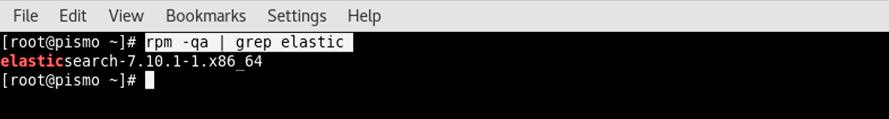
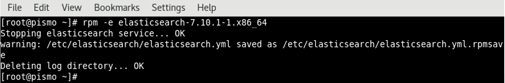
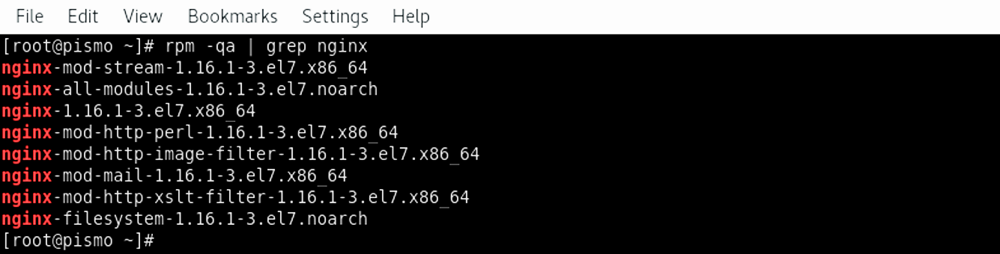

<p id=“uninstall”></p>

## Uninstall Diskover

The following outlines how to uninstall the Diskover's components.

🚧 &nbsp;We're hard at work updating these instructions. Meanwhile, [click here to open a support ticket](https://support.diskoverdata.com/), and we'll gladly assist you with uninstalling all the Diskover components.

### Uninstall Elasticsearch

🔴 &nbsp;Determine the Elasticsearch version installed:
```
rpm -qa | grep elastic
```



🔴 &nbsp;In the above example, remove **elasticsearch-7.10.1-1.x86_64**. 🚧 Note that instructions for Elaticsearch v8 are being prepared:
```
rpm -e elasticsearch-7.10.1-1.x86_64
```



### Uninstall PHP-FPM

🔴 &nbsp;Determine PHP-FPM version installed:
```
rpm -qa | grep php-fpm
```

🔴 &nbsp;In the previous example, remove **php-fpm-7.3.26-1.el7.remi.x86_64**. 🚧 Note that instructions for PHP v8 are being prepared:

```
rpm -e php-fpm-7.3.26-1.el7.remi.x86_64
```


### Uninstall NGINX

🔴 &nbsp;Determine NGINX version installed:
```
rpm -qa | grep nginx
```



🔴 &nbsp;In the above example, remove all NGINX with the **--nodeps** argument to uninstall each package in the above list:
```
rpm -e --nodeps rpm -qa | grep nginx
```

### Uninstall Diskover-Web

🔴 &nbsp;To uninstall the Diskover-Web components, simply remove the install location:
```
rm -rf /var/www/diskover-web
```

### Uninstall Task Worker Daemon

#### Uninstall Task Daemon for Linux

🔴 &nbsp;To uninstall the Task Daemon on Diskover indexer(s) perform the following:
```
systemctl stop diskoverd.service
```

```
rm /etc/systemd/system/diskoverd.service
```

#### Uninstall Task Daemon for Windows

🚧 We're hard at work preparing these instructions. Thanks for your patience!

#### Uninstall Task Daemon for Mac

🚧 We're hard at work preparing these instructions. Thanks for your patience!

### Uninstall Diskover Indexers

#### Uninstall Indexers for Linux

🔴 &nbsp;To uninstall the Diskover indexer components simply remove the install location:
```
rm -rf /opt/diskover
```

🔴 &nbsp;Remove the configuration file locations:
```
rm -rf /root/.config/diskover*
```

#### Uninstall Indexers for Windows

🚧 &nbsp;We're hard at work preparing these instructions. Meanwhile, [click here to open a support ticket](https://support.diskoverdata.com/), and we'll gladly assist you with uninstalling all the Diskover components.

#### Uninstall Indexers for Mac

🚧 &nbsp;We're hard at work preparing these instructions. Meanwhile, [click here to open a support ticket](https://support.diskoverdata.com/), and we'll gladly assist you with uninstalling all the Diskover components.
