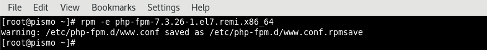

### Uninstall PHP-FPM

#### Uninstall PHP-FPM for Linux

🔴 &nbsp;Determine PHP-FPM version installed:
```
rpm -qa | grep php-fpm
```

🔴 &nbsp;In the previous example, remove **php-fpm-7.3.26-1.el7.remi.x86_64**:

```
rpm -e php-fpm-7.3.26-1.el7.remi.x86_64
```


