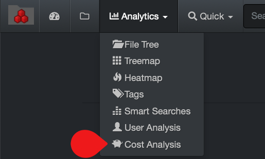

<h3 id="cost_analysis">Cost Analysis Report</h3>

The cost analysis report offers a snapshot of where your storage money is being allocated. This tool is designed to control your operating costs  by:

- Charging your customers appropriately for storage.
- Incentivize cleanup/data curation instead of purchasing more storage.

<h4 id="cost_config">Storage Cost Calculation and Configuration Overview</h4>

The initial setup is enabled and configured by a System Administrator using your organization’s real figures. Here is an example of how the cost is calculated:

>Storage cost is $100/TB x client's project is using 10 TB = cost for that client's project is $1,000

There are many other factors that can be compounded to the cost of the storage itself, for example:

- Electricity.
- Square footage of building space for physical units.
- Support contract.
- System Administrator’s salary.
- Diskover’s annual subscription cost.

>🔆 Different storage volumes can have different costs associated to them.

You need an admin account to edit the customizable cost analysis reports.

#### Storage Cost Configuration Overview

This diagram explains how storage cost is enabled and configured by your System Administrator.

_[Click here for a full screen view of the Storage Cost Configuration Overview diagram.](images/diagram_diskover_storage_cost_configuration_overview_with_border.png)_

#### Accessing the Cost Analysis Report

Via the  **Analytics**  drop-down list:

#### Using the Cost Analysis Report

The cost analysis report offers repeatable reports that can be configured by project, client, aging, etc.

A) Apply selection for results to include files, directories and/or top path only.

B) Results in dollar figures – click on a category to open the results in the search page.

C) Results in size figures – click on a category to open the results in the search page.

D) The cost analysis  report is global for all storage volumes, selecting any of these options will not affect the results. If you want to narrow the results to one or more specific storage volumes, select the desired volume(s) in the [indices](#indices) page and navigate back to this report.

E) You can view the queries used for the report, but an admin account is required to edit them.

#### Cost Analysis in File Search Page

Once the cost analysis tool is enabled and configured by your System Administrator, the cost associated to a folder or a file can be viewed in the file search page.

