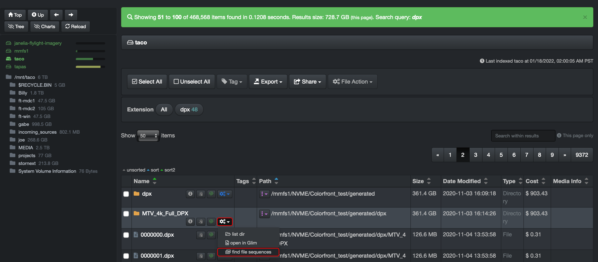
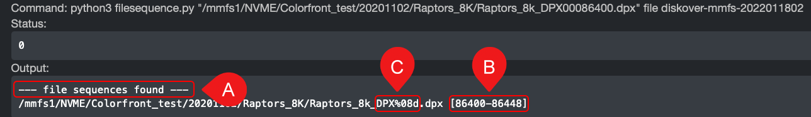

___
## Find All Files in a Sequence 
___

Diskover allows you to easily find all files in a sequence via **File Action**.

**Launch from a file** > you do not need to select the line if you launch directly from the A) inline icon, it's been selected in this example to show the option of launching it from the B) File Action button:

**Launch from a directory** > the same logic as launching form a file applies here as well:

The results will open in a new page and showing the complete path where the sequence is located, as seen at the bottom here:

A) Will confirm if a sequence was found.

B) Give you the sequence range - if there was a break in the sequence, there would be [multiple brackets].

C) In this example, the value means that the sequence has 0 padding and is 8 digits long, **DPX** being included in the digits > DPX86400
