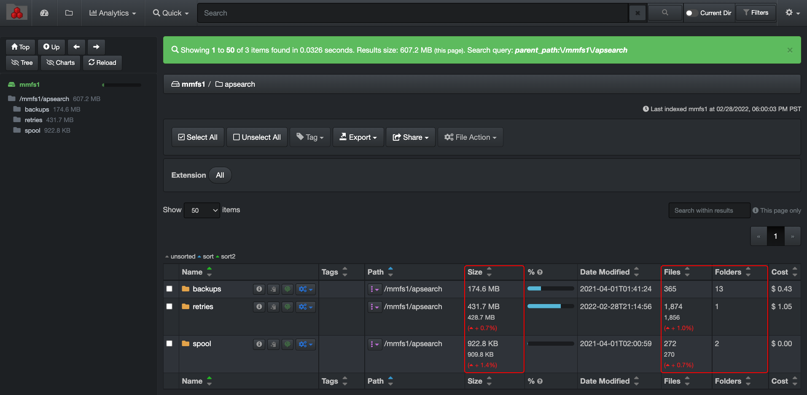

<h3 id="heatmap">Heatmap Report</h3>

The heatmap report is a powerful analytical snapshot offering a differential comparison of two indices across two different points in time:

- Location of data growth and shrinkage, as well as the absence of activity.
- Insightful for data curation efforts.
- Useful tool for Data Managers, Operation Managers and customer service personnel when waiting for new projects to come in.

The red and green colors in the heatmap report have meaning. All other colors are just a gradation between the red and the green.

> Red = Data Growth
> 
> Green = Data Reduction

The absence of colors in a heatmap report is also very meaningful, revealing data inertia, alerting you of possible anomalies. The lack of colors/activity is also a good indicator when comparing, for example, an on-premise server to a backup of that server in the cloud where you want data in both storage volumes to be identical; inertia in that case being favorable.

#### How to Select Indices for the Heatmap Report

Before accessing the heatmap report, you need to [select 2 indices from 2 different points in time](#index_selection). You will want to select the same index/storage volume name from both columns D & E in order to compare the same data.

>🔆 Sometimes, the storage volumes don’t need to have the same name to be compared. For example, a storage volume could be on a physical server with one name, and another storage volume could be a backup with the same data set in the cloud with a different name.

Here is a quick visual recap for heatmap  purposes only:

A) From the gear icon drop-down list, select  **Indices**.

B) Remove the  **Always use latest indices**  selection.

C) Select the aging of the indices you want to make available in the list.

D) Select one index from  **Index**  column.

E) Select one index from  **Index 2**  column, it should technically be the same storage volume name as in  **Index**  column, but at a previous date.

F) Click  **Save selection**.

>🔆 The instructions in the blue info bars are practical for quick references.

#### Accessing the Heatmap Report

You need to select the indices you want to compare as explained above before accessing the report, otherwise you’ll get an error message.

Via the  **Analytics**  drop-down list:

Via the search page by clicking this icon in the results pane:

#### Using the Heatmap Report

A) **Path bar**: You can view as well as manually type in the path you want to investigate.

B) **Go**: If you manually enter or edit a value in A) path bar, the  **Go**  button acts like a  **Return**  key.

C) **Up Level**: Will bring you one directory up per click until you reach the top of the storage volume.

D) **Reload**: To reload the chart and tree cache/data.

E) **Size Filter**: To select the size of the files you want to pinpoint in the results.

F) **Mtime Filter**: To select a specific period when the files were last modified.

G) **Hide Thresh**: To make the graphics less busy by hiding the results with low percentages.

H) **Size or Count**: Select either you want to see the report by the size of the directories/files or by count.

I) **Maxdepth**: Select how many levels/directories deep you want the results to show.

J) **Show new dirs**: Leave unselected if you want to hide all the new directories that might have been created, as it can be misleading by adding a lot of red due to the fact that they are new. New directories can distract from the real changes you want to analyze OR it can be exactly what you are looking for.

K) **Show Files**: By default, the results will only show directories, select if you want to see files instead.

L) **Filters**: Summary of the filters or preferences that you might have selected.

M) **Items per page**: To modify the number of items per page (between 10 to 100).

N) **Search within page**: To refine your search for the current page only, acts as CTRL/CMD + F:
>- You can only search with letters or numbers; it will not accept [operators](#operators) or other special characters.
>- You cannot and do not need to use the **\*** wild card as this field will search on partial words or numbers.
>- It will not search inside the directories, only on the results displayed on the page.

O) **Results pane**: You can sort on a single column at a time.

P) **Show path in heatmap** **icon**: Will show the heatmap report for that particular path.

Q) **Search for path icon**: To open that path in the search page.

R) **Navigation within pages of results**: To go back and forth if you have several pages of results.

#### Comparing Indices in the Search Page

You can compare indices in the search page as well. You will see red/growth or green/shrinkage status results:

