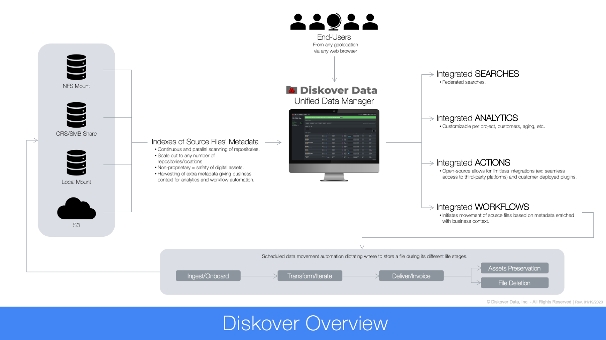

___
### Indices

#### [🍿 Watch Quick Tips | Indexing and Live View](https://vimeo.com/767272643)

Diskover continuously scans all your volumes and creates new indices to give you the latest snapshot of all your files and their attributes. This diagram is a simplistic way of explaining how the data is scanned.

_[Click here for a full-screen view of the Diskover Overview.](images/diagram_diskover_architecture_overview_for_endusers.png)_

#### Always Use Latest Indices by Default

&nbsp;&nbsp;&nbsp;&nbsp;

You can access the available indices by clicking the  **gear icon** drop-down menu > then select **Indices**.

The indices default is set to **always use latest indices** so you can search all the latest indexed data and volumes at all times. 

#### Selecting Specific Indices

&nbsp;&nbsp;&nbsp;

This section will guide you on how to select specific indices, some examples of why this could be relevant:

- You need to go back to an older index (or indices) for search, comparison, monitoring, or reporting purposes.
- You may want to select two indices to search across different points in time for comparison purposes (ex: this file is not here today, was it there two days ago?). Selecting different indices is also needed for the [heatmap report](#heatmap).
- If you have multiple volumes connected to Diskover and only some of them are relevant to your work, you may want to restrict which indices you want to search and have access to.

>🔆 &nbsp;Take the time to read the tips in the blue message bars.

A) **Always use latest indices**: If you must manually select specific indices, make sure to deselect that box first.

B) **Show Indices newer than**: Select the aging of the indices you want to filter and make available in the list.

C) **Select all**: Click to select all indices from column H) Index.

D) **Unselect all**: Click to unselect all indices from either column H) Index or I) Index 2.

E) **Save Selection**: If you manually click indices from either column H) Index or I) Index 2, you need to click  **Save selection**  before leaving the indices page.

F) **Show # Entries**: You can change how many rows of indices you want to display on a page (between 10 to 100).

G) **Search**: You can search within the indices with a name or date (indices name will show date of each scan with format yyyymmdd), but you cannot use [operators](#operators), [wildcards](#wildcards), or complex syntax - see the [search within results](#search_within_results) section for more details.

H) **Index** column: If you are not using A) always use latest indices, you need to select at least one index by clicking a box in this column and then click E) Save selection.

>🔆 &nbsp;Selecting multiple indices in the H) index column allows you to search across more than one index, as well as quickly access/switch the said indices using the  **Storage volumes**  drop-down list in the file search page.

I) **Index 2**: If you are not using A) always use latest indices, selecting indices in this column is optional and is used for data comparison like the [heatmap report](#heatmap).

>🔆 &nbsp;When selecting more than one index from H) Index, you cannot select an index from I) Index 2.

J) **Results pane**: The results are sorted by ascending creation date by default - you can sort differently by clicking on the grey arrows in the headers.
  - **Start Time**: The date/time the scan started indexing (UTC time unless you [changed your settings to your local time](#time)).
  - **Finish Time**: The date/time the scan finished indexing (UTC time unless you [changed your settings to your local time](#time)).
  - **Crawl Time**: The time a scan took to index that storage volume.
  - The other columns are self-explanatory.

K) **Reload indices**: To refresh the list of indices.

L) **Max indices to load**: To reduce the number of indices to load at all time.

#### Indexing Schedule

&nbsp;&nbsp;&nbsp;&nbsp;

The System Administrator of your facility is responsible for configuring the indices’ scanning schedule. Scans are scheduled according to your organization's work pace and how much data a [volume](#storage_volume) contains. For high pace work environments like media production for example, new scans may be scheduled soon after the previous one is completed. Note that Diskover scans all storage volumes parallelly, not serially.
