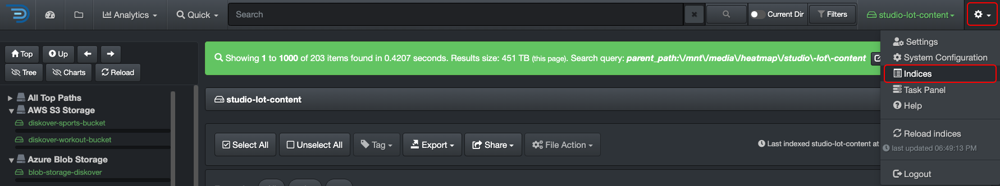
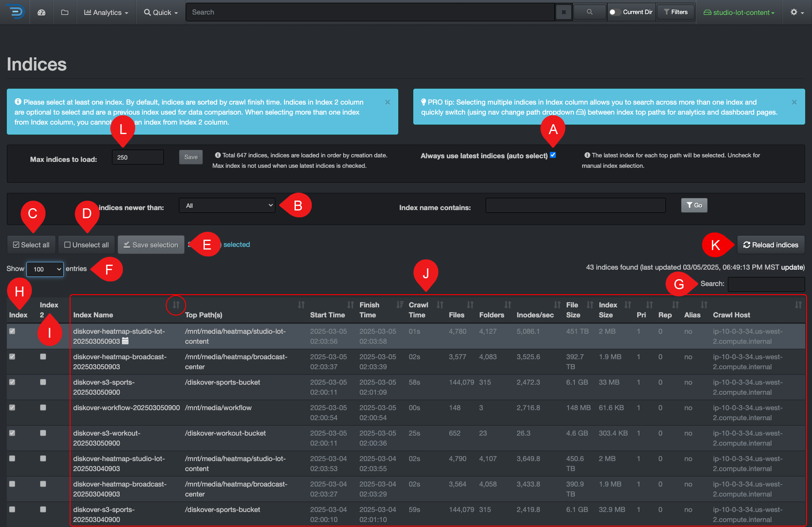

### Indices

#### [🍿 Watch Quick Tips | Indexing and Live View](https://vimeo.com/767272643)

Diskover continuously scans all your storage volumes and creates indices, which act like snapshots of your files and their attributes at a specific point in time. These indices provide an up-to-date view of your data, allowing you to quickly analyze file sizes, types, ownership, usage patterns, and more. By regularly refreshing indices, Diskover ensures you always have the latest insights into your storage environment, helping with all aspects of sustainable data management.

#### Accessing the Indices

You can access the indices by selecting ⚙️ → **Indices**.

#### Indices Overview

✏️ Take the time to read the tips in the blue message bars, they are very helpful!

| REFERENCE | DESCRIPTION |
| :---: | --- |
| A | **Always use latest indices**: This box is selected by default so you can search all the latest data at all time—if you must manually select specific indices, make sure to deselect that box first. |
| B | **Show Indices newer than**: You can filter your indices by aging to narrow down the list of indices in your results. |
| C | **Select all**: Will select all indices from column 🅗. |
| D | **Unselect all**: To unselect all indices—you must first deselect **Always use latest indices**. |
| E | **Save Selection**: If you manually select indices from either column 🅗 and/or 🅘, you need to click  **Save selection**  before leaving the indices page. |
| F | **Show # Entries**: To change how many rows of indices/results you want to display on a page (between 10 to 100). |
| G | **Search**: You can filter your indices by searching with a keyword, only leaving the desired indices in your results by hiding the other lines. |
| H | **Index**: For manual selection of an index when **Always use latest indices** is deactivated. |
| I | **Index 2**: For manual selection of an index when **Always use latest indices** is deactivated and selecting indices for the [heatmap report](#heatmap). |
| J | **Results pane**: The results are sorted by ascending creation date by default - you can sort differently by clicking on the ascending or descending arrows in the headers:<ul><li>**Start Time**: The date/time the scan started indexing (in UTC unless you [changed your settings to your local time zone](#time)).</li><li>**Finish Time**: The date/time the scan finished indexing (in UTC time unless you [changed your settings to your local time zone](#time)).</li><li>**Crawl Time**: The time a scan took to index that storage volume.</li></ul> |
|

K) **Reload indices**: To refresh the list of indices.

L) **Max indices to load**: To reduce the number of indices to load at all time.

#### Indexing Schedule

The System Administrator of your facility is responsible for configuring the indices’ scanning schedule. Scans are scheduled according to your organization's work pace and how much data a [volume](#storage_volume) contains. For high pace work environments like media production for example, new scans may be scheduled soon after the previous one is completed. Note that Diskover scans all storage volumes in parallel, not serially.

#### Selecting Specific Indices

This section will guide you on how to select specific indices, some examples of why this could be relevant:

- You need to go back to an older index (or indices) for search, comparison, monitoring, or reporting purposes.
- You may want to select two indices to search across different points in time for comparison purposes (ex: this file is not here today, was it there two days ago?). Selecting different indices is also needed for the [heatmap report](#heatmap).
- If you have multiple volumes connected to Diskover and only some of them are relevant to your work, you may want to restrict which indices you want to search and have access to.
