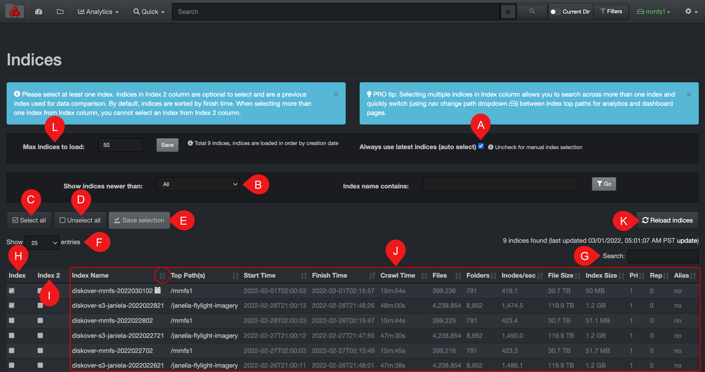

___
### Indices
___

The default is set to use the most recent  indices. You may want to select multiple indices to search across different points in time for comparison purposes (ex: this file is not here today, was it there two days ago?). Selecting different indices is also needed for the [heatmap report](#heatmap).

Diskover continuously scans all your storage volumes and creates new indices to give you the latest snapshot of all your files and their attributes. This diagram is a simplistic way of explaining how the data is scanned.

You can access the available indices within the  **gear icon** drop-down menu.

#### Using the Latest Indices

When you log in, Diskover automatically defaults to the latest indices.

Unless you must compare indices from different points in time or want to use the [heatmap report](#heatmap), you always want to use the latest indices and the  **Always use latest indices**  box needs to be selected.

#### Selecting Indices

This section will guide you in case you need to go back to an older index (or indices) for search, comparison, or reporting  purposes.

Selecting multiple indices in the H) index column allows you to search across more than one index, as well as quickly access/switch the said indices using the  **Storage volumes**  drop-down list in the file search page.

This part of the interface is best explained visually along with the instructions below. Note that the indices are sorted by ascending creation date but can be sorted as you wish using the arrows in J) headers in the results pane.

>🔆 Take the time to read the instructions and tips in the blue message bars.

A) **Always use latest indices**: If you must manually select indices, make sure to deselect that box first.

B) **Show Indices newer than**: Select the aging of the indices you want to make available in the list.

C) **Select all**: Click to select all indices from column H) Index.

D) **Unselect all**: Click to unselect all indices from either column H) Index or I) Index 2.

E) **Save Selection**: If you manually click indices from either column H) Index or I) Index 2, you need to click  **Save selection**  before leaving the indices page.

F) **Show # Entries**: You can change how many rows of indices you want to display in a page (between 10 to 100).

G) **Search**: You can search within the indices with a single name or date (indices name will show date of each scan with format yyyymmdd), but you cannot use [operators](#operators) or complex syntax.

H) **Index** column: If you are not using A) always use latest indices, you need to select at least one index by clicking a box in this column and click E) Save selection.

I) **Index 2**: If you are not using A) always use latest indices, selecting indices in this column is optional and is used for data comparison like the [heatmap report](#heatmap).

>🔆 When selecting more than one index from H) Index, you cannot select an index from I) Index 2.

J) **Results pane**: You can find valuable information in those columns, which can be sorted by clicking on the grey arrows in the headers.
>- **Start Time**: The date/time the scan started indexing (UTC time unless you [changed your settings to your local time](#time)).
>- **Finish Time**: The date/time the scan finished indexing (UTC time unless you [changed your settings to your local time](#time)).
>- **Crawl Time**: The time a scan took to index that storage volume.
>- The other columns are self-explanatory.

K) **Reload** **indices**: To refresh the list of indices.

#### Indexing Schedule

The System Administrator of your facility is responsible for configuring the indices’ scanning schedule. Scans are scheduled according to the users’ needs; for high pace work environment like media production, new scans may be scheduled soon after the previous one is completed. Diskover scans all storage volumes parallelly, not serially.
