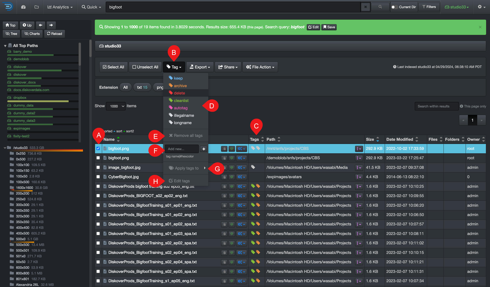
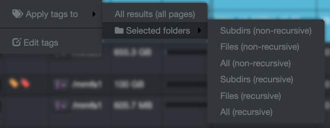
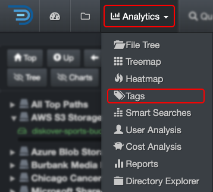
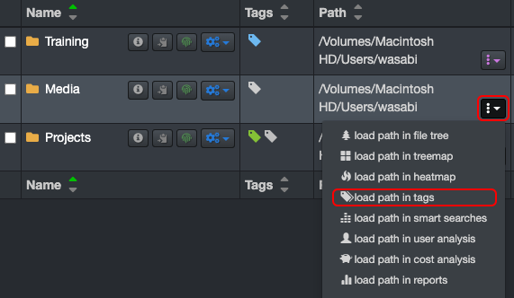
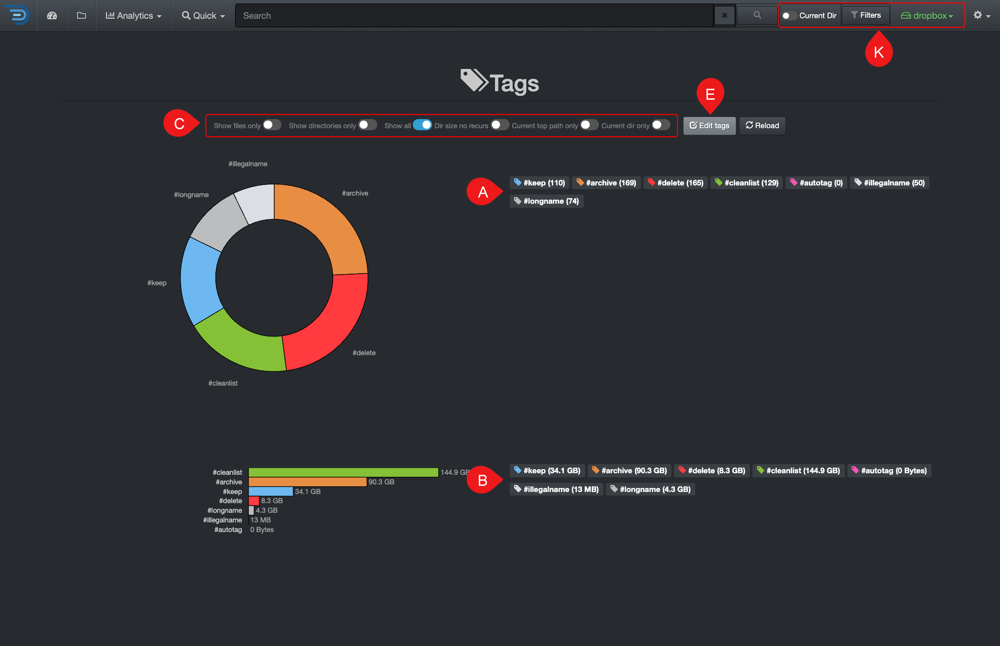
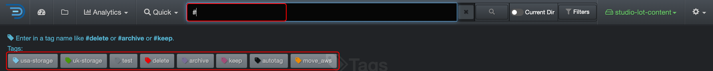

### Tags

&nbsp;&nbsp;&nbsp;&nbsp;&nbsp;&nbsp;&nbsp;&nbsp;&nbsp;&nbsp;&nbsp;&nbsp;

Tags are additional metadata attached to files or directories, providing business context and triggering data curation actions like archiving or deletion. Tagging is essential for streamlined workflows and effective [data curation](#data_curation).

This section covers **manual tagging**. Your System Administrator can configure and schedule automated tags, known as [AutoTags](https://docs.diskoverdata.com/diskover_setup_and_config_guide/#tags), and those are usually for data hygiene, lifecycle management, etc., to safely and methodically curate data in the backend.

#### Tags Overview

| REFERENCE | DESCRIPTION |
| :---: | --- |
| A | **Select** file(s) and/or directory(ies) to be tagged: You must first select one or more items to add or remove a tag; otherwise, the tag button will remain inaccessible. |
| B | **Tag** button: Opens a drop-down list with several options—you must first select one or more items for this button to work. |
| C | **Tags column**: To see tags  associated with a file or directory, go to your [settings](#hide_columns) to unhide that column if not visible. |
| D | **Tag selection**: List of configured tags—you need an admin account to edit that list. |
| E | **Remove all tags**: You need to select the items you wish to remove the associated tags from first. ⚠️ You can't undo this action. |
| F | **Add new tag**: To quickly add a single new tag—an admin account is required to add new tags:<ul><li>The tag needs to be entered in that exact format: **tag_name\|#hexcolor**, for example, **move_aws\|#FF9300**</li><li>✏️ You can type the name of a color, like **move_aws\|orange** instead of using an **#hexcolor** code.</li></ul> |
| G |  **Apply tags to**: Choices of applying tagsChoose to apply tags [non-recursively or recursively](#recursive). This can only be done from a directory that already has an assigned tag(s), allowing you to propagate the same tag(s) recursively or non-recursively.  <ul><li>**All results (all pages)**: Will apply tags to all your current search results, no matter if they are files or directories, and no matter how many pages of results, but will not apply tags recursively.</li><li>**Selected Folders**:<ul><li> **[Non-recursive](#recursive)**: Will apply tags exclusively to the current path/directory.</li><li> **[Recursive](#recursive)**: Will apply tags to the current path/directory, as well as all its sub-directories and files.</li></ul></ul> |
| H | **Edit Tags**: An admin account is required to [add/edit tags]. |

#### Manual Tagging

##### Single Tag Application

✏️ A file or directory can have multiple tags.

1. Select the item(s) you wish to tag in the results pane.
2. Click the **Tag** drop-down list and select a tag.

##### Recursive and Non-Recursive Tags Application

✏️ If a directory has multiple tags, this action will propagate all tags to its parent directories and/or files.

1. Select the directory(ies) you wish to tag in the results pane.
2. Click the **Tag** drop-down list and select a tag - you need to tag the main directory first in order to tag recursively or non-recursively.
3. Reselect that same directory(ies) and click the **Tag** drop-down list again.
4. Select **Apply tags to** and [select an action](#apply_tags_to).

#### Tags Removal

✏️ Removing a tag is a bit like walking backward!

##### Single Tag Removal

1. Select the item(s) you wish to remove the tag from in the results pane.
2. Click the **Tag** drop-down list.
3. Select the same tag that you want to remove OR if the item has a single tag attached to it, you can select **Remove all tags**.

##### Multiple Tags Removal

1. Select the item(s) you wish to remove the tag from in the results pane.
2. Click the **Tag** drop-down list.
3. Select **Remove all tags** — ⚠️ this action can't be undone!

##### Recursive and Non-Recursive Tags Removal

1. Select the item(s) you wish to remove the tag recursively or non-recursively from in the results pane.
2. Remove the tag(s) from this directory first by following the appropriate previous instructions.
4. Reselect the directory and click the **Tag** drop-down list.
5. Select **Apply tags to** and [select an action](#apply_tags_to).

#### Tags Report

The tags built-in report gives a visual snapshot of all tagged items in all your volumes.

#### Accessing the Tags Report

| From the **Analytics** drop-down list | From the  located in the path column in the results pane |
| --- | --- |
| Will aggregate data from all volumes if no filters are activated.   | Will load the report for that path only.  |

#### Tags Report Overview

✏️ Hover over the graphics to view more detailed information.

| REFERENCE | DESCRIPTION |
| :---: | --- |
| A | Results by number of items – click on any link to open the results in the [search page](#search_page). |
| B | Results by size – click on any link to open the results in the [search page](#search_page). |
| C | Apply filters to further customize your results:<ul><li>**Show files only**: Will exclude directories from the results.</li><li>**Show directories only**: Will exclude files from the results.</li><li>**Show all**: To show both files and directories in the results.</li><li>**Dir size no recurs**: To restrict results to a non-recursive directory search [non-recusrsive](#recursive).</li><li>**Current top path only**: To limit the results to 🅓 selected [volume](#volume).</li><li>**Current dir only**: If applicable, to limit the results to the path you selected in the search page and locked down via [Current Dir](#current_dir) before navigating to the Tags report.</li></ul> |
| D | The Tags report is global, if you want to narrow the results:<ul><li>To a single volume: Activate the **Current top path only** filter.</li><li>To a specific path: Activate the **Current dir only** filter as described in 🅒. |
| E | **Edit Tags**: You can view the queries used for the report, but editing them requires an admin account. If you need to add or edit a search query and don’t have admin access, contact your System Administrator. |

#### Search on Tags

There are several ways to search on tags, here are a few.

- Search on tags using [filters](#filters).
- Search on tags using [field names](#search_field_names), for example, type `tags:delete` in your search bar—you can combine that with any other criteria.
- You can launch a tag report anytime directly from the search bar by typing **#**:
  -  A list of tags will appear beneath the search bar.
  -  Simply click on the desired report to view its results on the search page.

