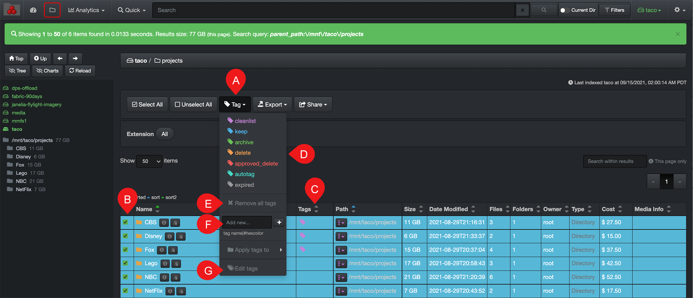
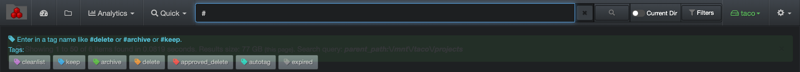
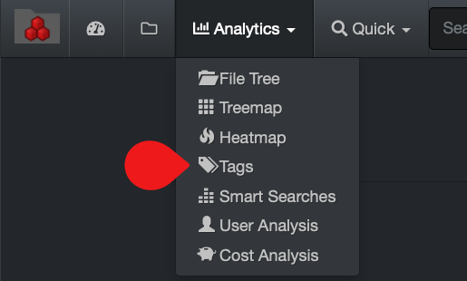

___
### Tagging

&nbsp;&nbsp;

Tags are additional metadata assigned to an item, they are used to add business context or data curation actions to be taken (ex: archive, delete, keep, clean). Tagging is crucial for smooth workflows and proper curation of data.

This section will talk about manual tagging, but Diskover can also be configured to schedule automated tasks to apply autotags, usually based on aging or service agreements, etc., in order to safely and methodically curate data in the backend.

>🔆 &nbsp;A file or directory can have multiple tags.

A) **Tag** drop-down list: To add or remove tags.

B) **Select** file(s) and/or directory(ies) to be tagged: You first need to select one or several items in B) to add or remove a tag.

C) **Tags** column: To see tags  associated with a file or directory.

D) **Tags** selection: List of tags  that are available, you need an admin account to edit that list.

E) **Remove all tags**: Select from column B) the items you wish to remove the associated tags first and then select E).
>**WARNING!**  you cannot undo this action.

F) **Add new tag**: To quickly add a single new tag - an admin account is required to add/edit tags.

G) **Apply tags to**: Choices of applying tags [non-recursively or recursively](#recursive).

> **Non-recursive**: Will apply tags to the next level of sub-directories and/or files of the selected directory.

> **Recursive**: Will apply tags to the all next levels of sub-directories and/or files of the selected directory.

H) **Edit Tags**: An admin account is required to add/edit tags.

#### Search on Tags

You can search on tags  using the [filters](#filters) tool or by  manually entering a query in the search bar.

##### Via the [filters](#filters) tool:

1. Click on the  **[Filters](#filters)**  icon at the top of the interface.
3. Go to the  **Tags**  section.
4. Select  **is**  or  **is not**.
5. Click on the boxes/tags  you wish to include/exclude from your search.
6. Click  **Save filters**  at the bottom of the window.

##### Via manual query in the search page:

Type your search query in the search bar at the top of the page:
>- To search on tags, you must start with a  **#**, ex: #archive
>- You can also use [operators](#operators) to search on more than one tag, ex: #archive OR #delete
>-  When starting a query with  **#**  Diskover will automatically detect your intentions and offer you to select one of the available tags.

#### Accessing the Tags Report

The tags  built-in report gives a visual snapshot of all tagged items in all your storage volumes. Note that the colors have no particular meaning in this report.

A built-in report is accessible via the  **Analytics**  drop-down list:

#### Using the Tags Report

A) Slide the buttons to refine the results.

B) Gives a total count of items – click on any tag/report to open the results in the search  page.

C) Gives a total in size – click on any tag/report to open the results in the search  page.

D) The analytics tag report is global and returns results for all storage volumes, their directories and files. Selecting any of these options will not affect the results. If you want to narrow the results to one or more specific storage volumes, select the desired volume(s) in the [indices](#indices) page and navigate back to this report.

E) You can view configured tags, but an admin account is required to edit them.
