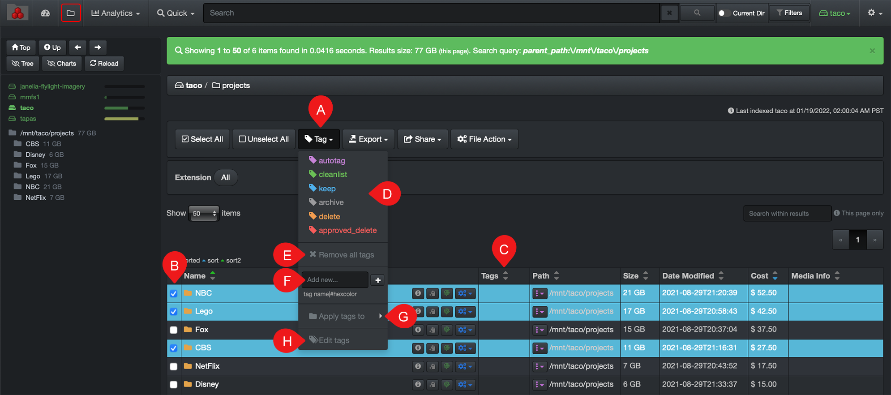
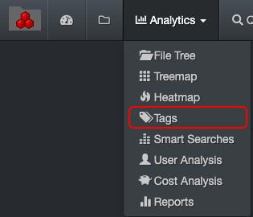

___
### Tags

&nbsp;&nbsp;&nbsp;&nbsp;&nbsp;&nbsp;

Tags are additional metadata assigned to an item, they are used to add business context or data curation actions to be taken (ex: archive, delete, keep, clean). Tagging is crucial for smooth workflows and proper [curation of data](#data_curation).

This section covers manual tagging, but Diskover can also be configured to schedule automated tasks to apply [autotags](https://docs.diskoverdata.com/diskover_configuration_and_administration_guide/#tagging-additional-business-context-metadata), usually based on aging,  service agreements, etc., in order to safely and methodically curate data in the backend.

>🔆 &nbsp;A file or directory can have multiple tags.

#### Tags Overview

A) **Tag** drop-down list: To add or remove tags, will not open until you select at least one item in the [results pane](#results_pane).

B) **Select** file(s) and/or directory(ies) to be tagged: You first need to select one or several items to add or remove a tag.

C) **Tags column**: To see tags  associated with a file or directory, go in your [settings](#hide_columns) to unhide that column if it's not visible.

D) **Tag selection**: List of tags that are available, you need an admin account to [edit that list](https://docs.diskoverdata.com/diskover_configuration_and_administration_guide/#tags-display-and-editor-within-diskover-web-user-interface).

E) **Remove all tags**: Select from column B) the items you wish to remove the associated tags first and then select E) > **WARNING!** you cannot undo this action.

F) **Add new tag**: To quickly add a single new tag in the drop-down list - an admin account is required to [add/edit tags](https://docs.diskoverdata.com/diskover_configuration_and_administration_guide/#tags-display-and-editor-within-diskover-web-user-interface).

G) **Apply tags to**: Choices of applying tags [non-recursively or recursively](#recursive) - can only be achieved from a directory and that directory needs to have a tag assigned to it prior in order to assign the same tag(s) recursively or non-recursively.

  - **All results (all pages)**: Will apply tags to all your current search results, no matter if they are files or directories, and no matter how many pages of results, but will not apply tags recursively.

  - **Selected Folders - [Non-recursive](#recursive)**: Will apply tags exclusively to the path/directory you are pointing to.

  - **Selected Folders - [Recursive](#recursive)**: Will apply tags to the path/directory, as well as all sub-directories and files, inside that path.

  

H) **Edit Tags**: An admin account is required to [add/edit tags](https://docs.diskoverdata.com/diskover_configuration_and_administration_guide/#tags-display-and-editor-within-diskover-web-user-interface).

#### Manual Tags Application

##### Single Tag Application

1. In the results pane, select the item(s) you wish to tag.
2. Click the **Tag** drop-down list and select a tag.

>🔆 &nbsp;A file or directory can have multiple tags.

##### Recursive and Non-Recursive Tags Application

This option is used to apply tags to multiple sub-directories and/or files in just a few clicks.

1. In the results pane, select the main directory(ies) you wish to tag.
2. Click the **Tag** drop-down list and select a tag - you need to tag the main directory first in order to continue.
3. Reselect that same directory(ies) and click the **Tag** drop-down list.
4. Click on **Apply tags to** and make a [selection](#apply_tags_to).

>🔆 &nbsp;If the main directory has several tags applied to it, all these tags will be applied to their parent directories and/or files with this action.

#### Tags Removal

>🔆 &nbsp;Removing a tag is a bit like walking backward.

##### Single Tag Removal

1. In the results pane, select the item(s) you wish to remove the tag from.
2. Click the **Tag** drop-down list:
  - **If an item has a single tag**: select **Remove all tags**.
  - **If an item has multiple tags and you only want to remove one of them**: select the same tag that is already applied to it > reapplying the same tag will remove it.

##### Multiple Tags Removal

1. In the results pane, select the item(s) you wish to remove the tags from.
2. Click the **Tag** drop-down list and select **Remove all tags** - careful, this action cannot be undone!

##### Recursive and Non-Recursive Tags Removal

1. In the results pane, select the directory for which you want to remove the tags recursively or non-recursively - remove the tag from this directory first by following the above instructions.
2. Reselect the directory and click the **Tag** drop-down list.
3. Click on **Apply tags to** and make a [selection](#apply_tags_to).

#### Search on Tags

You can quickly search on tags using the [filters](#filters) tool or using a manual query in the search bar.

##### Searching tags with [Filters](#filters):

Whether you are drilling down or running manual queries, adding tags rules to your filters will filter in OR out all items depending on the filters you apply.

1. Click on the  **[Filters](#filters)**  icon at the top of the interface.
3. Go to the  **Tags** section.
4. Select  **is**  or  **is not**.
5. Click on the boxes/tags you wish to include/exclude from your search.
6. Click  **Save filters**  at the bottom of the window.

##### Searching tags via manual queries:

Type your search query in the search bar at the top of the page:

  - When starting a query with  **#**  Diskover will automatically detect your intentions and offer you to select one of the available tags, you can also directly type, ex: **#archive**

  

  - You can also use [**operators**](#operators) to search on more than one tag at a time, ex: **#archive and #delete**, **(#archive or #delete)**
  - You can use the [**field name**](#search_field_names) to search on tags, ex: **tags:delete**, note that this query is case sensitive, **tags** needs to be lower case and the **tag** needs to be typed exactly as listed in the tags drop-down list.

#### Tags Report

The tags built-in report gives a visual snapshot of all tagged items in all your storage volumes. Note that the colors have no particular meaning in this report.

#### Accessing the Tags Report

Via the  **Analytics**  drop-down list for global results:

Via the results pane by clicking this icon to investigate a particular path.

#### Tags Report Overview

A) Reports with results in number of items – click on a report to open the results in the search page.

B) Same queries as A), but with results in size instead – click on a report to open the results in the search page.

C) Apply filters to further customize your results:

  - **Show files only**: Will exclude directories from the results.
  - **Show directories only**: Will exclude files from the results.
  - **Show all**: To show both files and directories in the results.
  - **Dir size no recurs**: To limit directory size to [non-recursive](#recusrive).
  - **Current top path only**: To limit the results to D) selected [volume](#storage_volume).
  - **Current dir only**: If applicable, to limit the results to the path you selected in the search page and locked down via [Current Dir](#current_dir) before navigating to Smart Searches.

D) Tags report is global, if you want to narrow the results:
  - To a single volume > activate the **Current top path only** filter.
  - To a specific path > activate the **Current dir only** filter as described in C).

E) **Edit tags**: An admin account is required to [add/edit tags](https://docs.diskoverdata.com/diskover_configuration_and_administration_guide/#tags-display-and-editor-within-diskover-web-user-interface).
