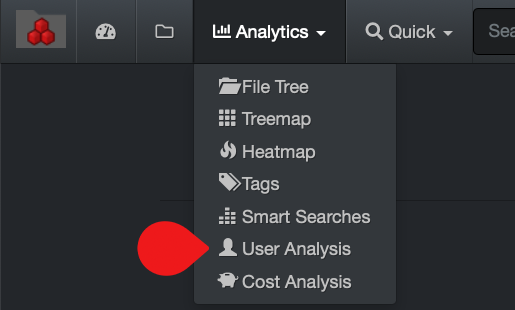
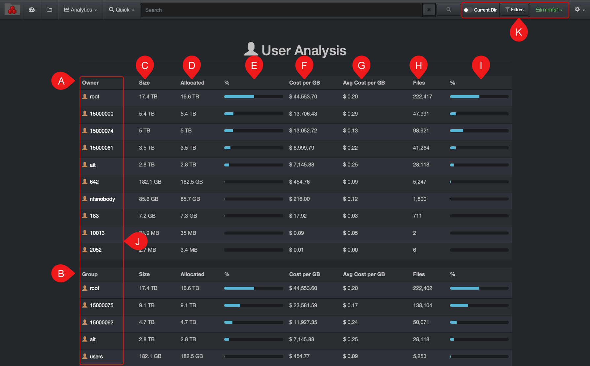

___
### User Analysis Report

&nbsp;&nbsp;&nbsp;&nbsp;

The user analysis  report gives a snapshot of data utilization; it was designed to help with operating costs  management, as well as customers’ storage consumption for billing accuracy.

This report needs to be enabled and configured by your System Administrator.

#### Accessing the User Analysis Report

Via the  **Analytics**  drop-down list:

#### Using the User Analysis Report

A) **Owner**: The owner/creator of a file. This report is configured by your System Administrator who may also have used a storage volume in place of a person/owner.

B) **Group**: A group might include several owners (ex: a department) and is configured by your System Administrator.

C) **Size**: Total of the file size under an owner or a group.

D) **Allocated**: The actual size that the files are occupying, can be helpful for [charging storage cost accordingly to clients](#cost_analysis).

E) **% Allocated**: Owner’s storage space usage divided by the total of all owners or groups.

F) **Cost per GB**: Total cost for the space used by an owner or a group, shares the same [storage cost calculation](#cost_config) as for the cost analysis report.

&nbsp;&nbsp;&nbsp;

G) **Avg cost per GB**: The average cost by GB for that owner or group. The cost depends on how each storage volume was configured by your system administrator.

&nbsp;&nbsp;&nbsp;

H) **Files**: Number of files linked to the owner or group.

I) **% File**: Files linked to the owner or group divided by the total of files of all owners or groups.

J) **Clickable links**: Click on any of the names under  **Owners**  or  **Groups**  to access the results in the file search page.

K) The user analysis  report is global for all storage volumes, selecting any of these options will not affect the results. If you want to narrow the results to one or more specific storage volumes, select the desired volume(s) in the [indices](#indices) page and navigate back to this report.
