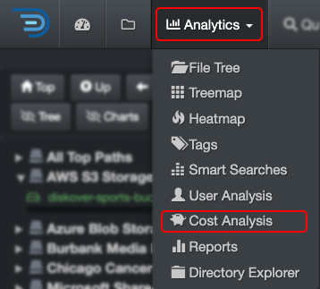
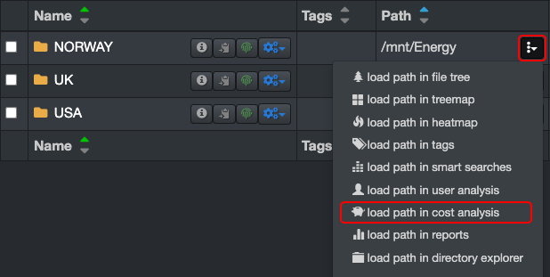
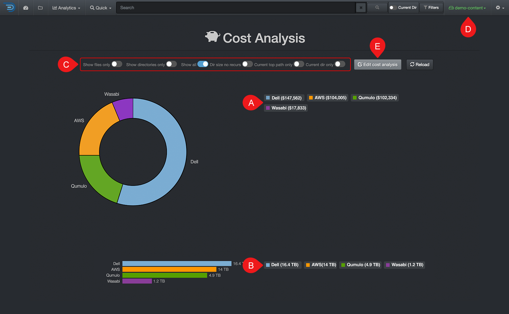
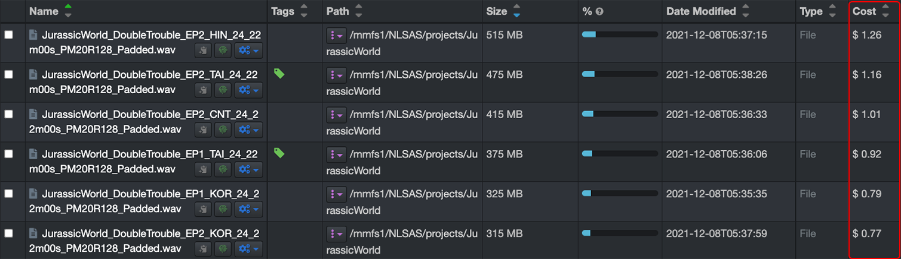
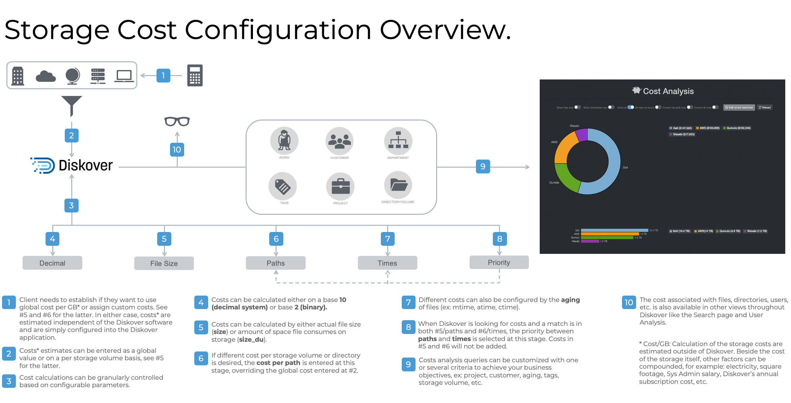

### Cost Analysis 

The Cost Analysis Report provides a snapshot of how your storage budget is allocated. It offers repeatable, customizable reports that can be configured by project, client, data aging, or other criteria relevant to your organization.

#### Accessing Cost Analysis

| From the **Analytics** drop-down list | From the  located in the path column in the results pane |
| --- | --- |
| Will aggregate data from all volumes if no filters are activated.   | Will load the report for that path only.  |

#### Cost Analysis Overview

✏️ Hover over the graphics to view more detailed information.

| REFERENCE | DESCRIPTION |
| :---: | --- |
| A | Results by number of items – click on any link to open the results in the [search page](#search_page). |
| B | Results by size – click on any link to open the results in the [search page](#search_page). |
| C | Apply filters to further customize your results:<ul><li>**Show files only**: Will exclude directories from the results.</li><li>**Show directories only**: Will exclude files from the results.</li><li>**Show all**: To show both files and directories in the results.</li><li>**Dir size no recurs**: To restrict results to a non-recursive directory search [non-recusrsive](#recursive).</li><li>**Current top path only**: To limit the results to 🅓 selected [volume](#volume).</li><li>**Current dir only**: If applicable, to limit the results to the path you selected in the search page and locked down via [Current Dir](#current_dir) before navigating to Cost Analysis.</li></ul> |
| D | Cost Analysis are global, if you want to narrow the results:<ul><li>To a single volume: Activate the **Current top path only** filter.</li><li>To a specific path: Activate the **Current dir only** filter as described in 🅒. |
| E | **Edit Cost Analysis**: You can view the queries used for the report, but editing them requires an admin account. If you need to add or edit a search query and don’t have admin access, contact your System Administrator. |

#### Cost Analysis in the Search Page

Once the cost analysis tool is [enabled and configured](#cost_config), the cost associated with a specific directory or a file can be viewed in the file search page.

#### Storage Cost Calculation and Configuration Overview

Storage cost can be set globally or per storage volume, directory, etc. This tool is designed to control operating costs by 1) charging clients accurately for storage of their projects and 2) clean-up/data incentivizing.

This feature is enabled and configured by your System Administrator. The storage costs can either be estimated globally, by storage volume, or down a directory level. The estimations need to be done outside of Diskover. Besides the cost of the storage itself, other factors can be compounded like electricity, service contract, System Administrator’s salary, subscription fees, etc. The estimations need to be calculated and configured per gigabyte.

_[Click here for a full-screen view of the Storage Cost Configuration Overview diagram.](images/diagram_storage_cost_configuration.png)_

