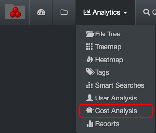

___
### Cost Analysis 

&nbsp;&nbsp;&nbsp;&nbsp;&nbsp;&nbsp;

The cost analysis report offers a snapshot of where your storage money is being allocated. This tool is designed to control your operating costs  by:

- Charging your customers appropriately for storage.
- Incentivize cleanup/data curation instead of purchasing more storage.

#### Storage Cost Calculation and Configuration Overview

The initial setup is enabled and configured by a System Administrator using your organization’s real figures. Here is an example of how the cost is calculated:

>Storage cost is $100/TB x client's project is using 10 TB = cost for that client's project is $1,000

There are many other factors that can be compounded to the cost of the storage itself, for example:

- Electricity.
- Square footage of building space for physical units.
- Support contract.
- System Administrator’s salary.
- Diskover’s annual subscription cost.

>🔆  &nbsp;Different storage volumes can have different costs associated with them.

This diagram explains how storage cost is [enabled and configured](https://docs.diskoverdata.com/diskover_configuration_and_administration_guide/#storage-cost-reporting) by your System Administrator.

_[Click here for a full-screen view of the Storage Cost Configuration Overview diagram.](images/diagram_diskover_storage_cost_configuration_overview_with_border.png)_

#### Accessing the Cost Analysis Report

Via the  **Analytics**  drop-down list for global results:

Via the results pane by clicking this icon to investigate a particular path.

#### Cost Analysis Overview

The cost analysis report offers repeatable reports that can be configured by project, client, aging, etc. whatever is relevant for your organization.

>🔆 &nbsp;Hovering over the graphics will give you a snapshot of their attributes.

A) Reports with results in number of items – click on a report to open the results in the search page. The [queries can be customized](#cost_config).

B) Same queries as A), but with results in size instead – click on a report to open the results in the search page.

C) Apply filters to further customize your results:

  - **Show files only**: Will exclude directories from the results.
  - **Show directories only**: Will exclude files from the results.
  - **Show all**: To show both files and directories in the results.
  - **Dir size no recurs**: To limit directory size to [non-recursive](#recusrive).
  - **Current top path only**: To limit the results to D) selected [volume](#storage_volume).
  - **Current dir only**: If applicable, to limit the results to the path you selected in the search page and locked down via [Current Dir](#current_dir) before navigating to Smart Searches.

D) Cost analysis is global, if you want to narrow the results:
  - To a single volume > activate the **Current top path only** filter.
  - To a specific path > activate the **Current dir only** filter as described in C).

E) **Edit cost analysis**: The [queries can be customized](#cost_config).

#### Cost Analysis in File Search Page

Once the cost analysis tool is [enabled and configured](#cost_config), the cost associated to a specific directory or a file can be viewed in the file search page.

