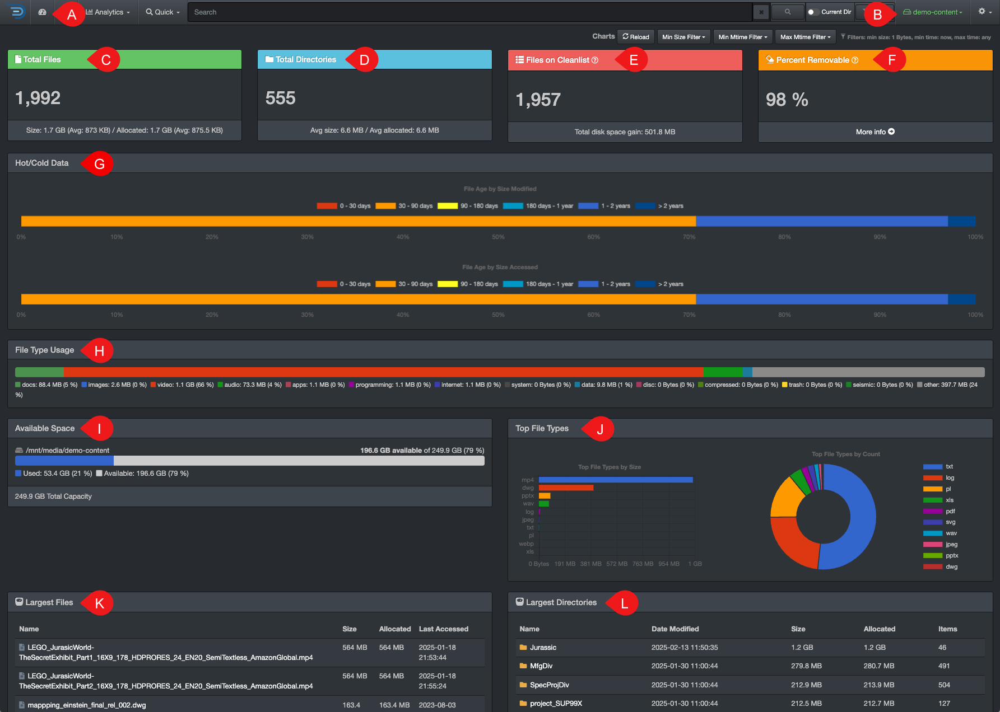

### Dashboard

The dashboard view is a great way to get a quick snapshot of an entire [volume](#volume). 

✏️ Hovering several areas will give you more information and many graphics are clickable to open the details in the [search page](#search_page).

| REFERENCE | SECTION | DESCRIPTION |
| :---: | --- | --- |
| A | **Dashboard button** | Click this button to access this dashboard view. |
| B | **Drop-down list** | Use the drop-down list to select a volume. |
| C | **Total Files** | Total number of files in the selected volume. Bottom bar: Total space consumed by the files, as well as average size per file. |
| D | **Total Directories** | Total number of directories in the selected volume. Bottom bar: Average space consumed by directory. |
| E | **Files on Cleanlist** | Gives an approximation of the files that are candidates for archival or deletion, the criteria to be in that list is _modification and access times older than 6 months_. Bottom bar: The total disk space gained if these files would be removed from that volume (total files size x percent removable = total disk space gain). |
| F | **Percent Removable** | Percentage result 🅔 Files on Cleanlist divided by 🅒 Total Files. |
| G | **Hot/Cold Data** | You can click on the bars to access the detailed results in the [search page](#search_page). |
| H | **File Type Usage** | Gives a snapshot of the file types (groups of file extensions) in the selected volume, click on the bars to open the detailed results in the [search page](#search_page). |
| I | **Available Space** | Shows the total space of the selected volume, as well as what is used and available. |
| J | **Top File Types** | Shows the top 10 file types and how much space they are consuming, click on any part of the graphic to access these files in the [search page](#search_page). |
| K | **Largest Files** | List of the top 10 largest files in the selected volume, you can display more results by clicking  **Show More** at the bottom of that section. |
| L | **Largest Directories** | List of the top 10 largest directories in the selected volume, you can show more results by clicking  **Show More** at the bottom of that section. |
