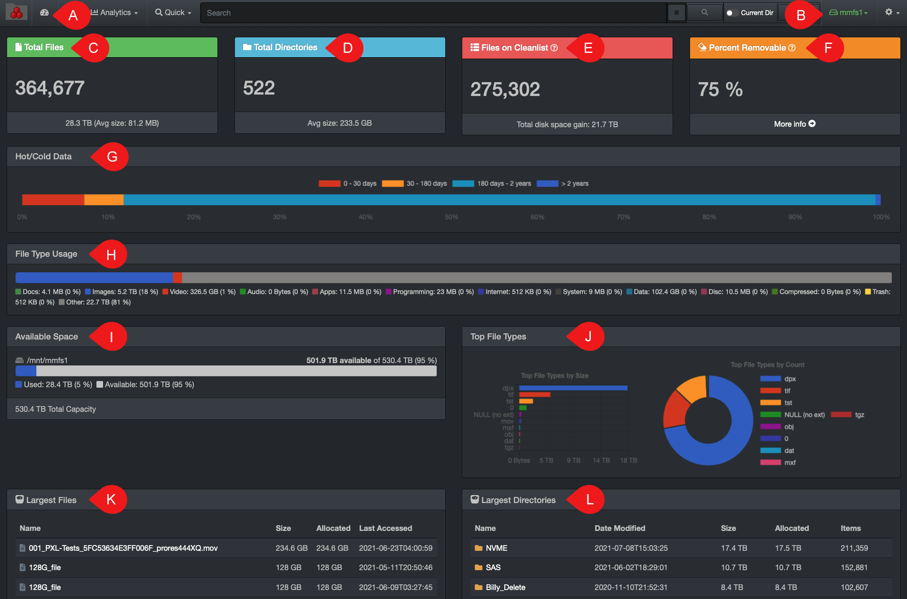

### Dashboard

The dashboard view is a great way to get a quick snapshot of a volume.

A) Click this icon to access the dashboard view.

B) Use the drop-down list to select or switch volume.

C) **Total Files**: Total number of files in the selected volume, total space consumed by the files, as well as average size per file.

D) **Total Directories**: Total number of directories in the selected volume and average space consumed by directory.

E) **Files on Cleanlist**: Gives an approximation of the files that are candidates for archival or deletion – criteria to be in that list is modification and access times older than 6 months.

> **Total disk space gain**  calculates how much space would be gained if the suggested F) Removable files would be archived or deleted (total files size x percent removable = total disk space gain).

F) **Percent Removable**: Percentage result of E) Files on Cleanlist divided by C) Total Files.

G) **Hot/Cold Data**: You can click on the legend to access the files/directories in that aging category, for example, clicking on  **30 – 180 days**  will open the files in the search page. If you’d try to click on  **> 2 years**  in this example, there would be no results as the result bar above doesn’t show any files/folders in that aging group.

H) **File Type Usage**: Gives a snapshot of the file types in the selected volume. You can click in the legend to view the available files via the search page.

I) **Available Space**: Shows the total space of the selected volume, as well as used and available space.

J) **Top File Types**: Shows the top 10 file types and how much space they are consuming. Click on a file type in the legend to access the files.

K) **Largest Files**: List of the top 10 largest files in the selected volume. You can show more results by clicking  **Show More** at the bottom of that pane.

L) **Largest Directories**: List of the top 10 largest directories in the selected volume. You can show more results by clicking  **Show More** at the bottom of that pane.
