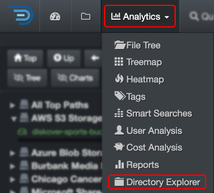
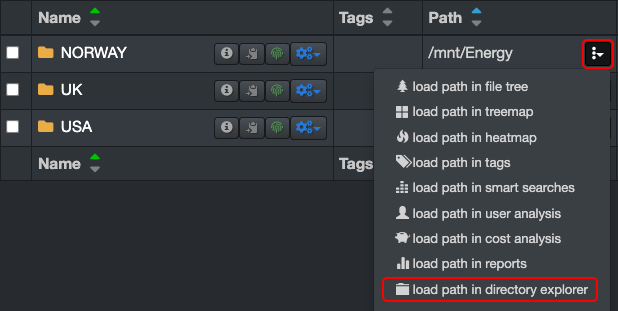
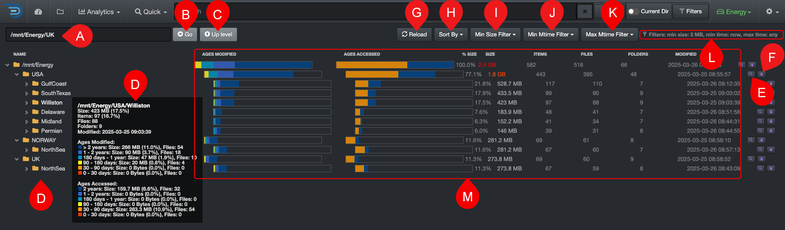
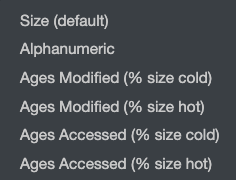

### Directory Explorer

The Directory Explorer provides a visual breakdown of file size, age, and activity across your directory structure. It helps you quickly identify where storage is being used, spot stale or unused data, and prioritize cleanup or archiving efforts—all in a single, drillable view.

#### Accessing Directory Explorer

| From the **Analytics** drop-down list | From the  located in the path column in the results pane |
| --- | --- |
| Will aggregate data from all volumes if no filters are activated.   | Will load the report for that path only.  |

#### Directory Exploerer Overview

✏️ Hover over the graphics to view more detailed information.

| REFERENCE | DESCRIPTION |
| :---: | --- |
| A | **Path bar**: You can view and paste a path to investigate. |
| B | **Go**: That button acts as a  **RETURN** key, for example, use if you paste a path in that bar. |
| C | **Up Level**: To drill up one directory at a time until you reach the top of the [volume](#volume). |
| D | **File Tree**: To drill down the file tree, note that hovering over any folder will open up a detailed summary. |
| E |  Click to open that path in the [search page](#search_page) for further investigation. |
| F |  To copy the path to your clipboard. |
| G | **Reload**: To reload the cached data for the chart and file tree. |
| H | **Sort By**: Different options to sort your file tree.  |
| I | **Min Size Filter**: To set a minimum data size threshold for filtering results. |
| J | **Min Mtime Filter**: To focus on a specific minimum modified time period. |
| K | **Max Mtime Filter**: To focus on a specific maximum modified time period. |
| L | **Filters**: Summary of the filters you might have selected. ⚠️These **filters will stay active**, even if you navigate away to other pages AND they will affect other analytics. |
| M | **Directory Details**: Full details of what's included in a path. |
