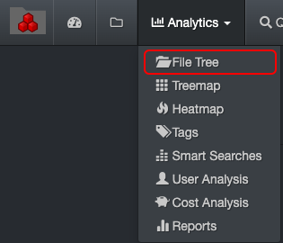
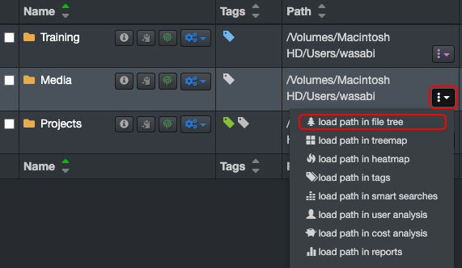
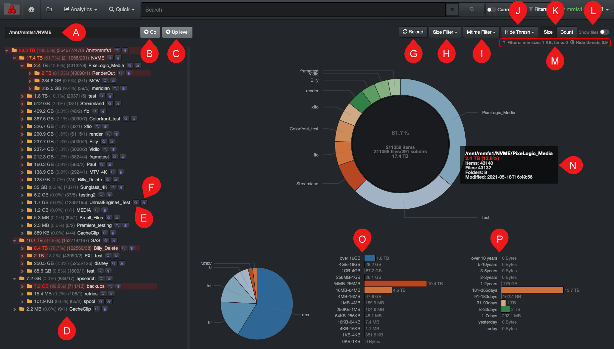

___
### File Tree Report

&nbsp;&nbsp;&nbsp;&nbsp;

The file tree  report profiles the size and aging of files for a selected storage volume or any of its directories. Some users find it easier to drill down using this page instead of the file search page. Note that the colors have no particular meaning in this report.

#### Accessing the File Tree Report

Via the  **Analytics**  drop-down list:

Via the search page by clicking this icon:

#### Using the File Tree Report

A) **Path bar**: You can view as well as manually type in the path you want to investigate.

B) **Go**: If you manually edit a value in A) path bar, the  **Go**  button acts as a  **Return**  key.

C) **Up Level**: Will bring you one directory up per click until you reach the top of the storage volume.

D) **Results pane**: In the file tree  view, the size of the directory or file is first; the name is last.

E) **Info**  **icon**: Click to open the directory and its file in the search page for further investigation.

F) **Copy Path icon**: To copy the path of a file or directory to your clipboard.

G) **Reload**: To reload the chart and tree cache/data.

H) **Size Filter**: To select the size of the files you want to pinpoint in the results – see the results in section  **O**.

I) **Mtime Filter**: To select a specific period when the files were last modified – see the results in section  **P**.

J) **Hide Thresh**: To make the graphics less busy by hiding the results with low percentages.

K) **Size or Count**: Select either you want to see the report by the  **Size**  of the directories/files or their  **Count**  – see the results changing in section  **O**  and  **P**.

L) **Show Files**: By default, the results will only show directories, select if you want to see files as well.

M) **Filters**: Summary of the filters or preferences that you might have selected.

N) **Attributes**: Hovering  your mouse over a directory or file in the graphic section will give you instant details.
