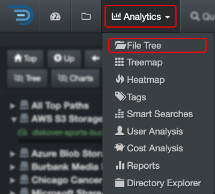

### File Tree

The File Tree Report provides insights into the size and aging of data for a selected [path](#path). Many users prefer this view for drilling down into data rather than using the [search page](#search_page. 

#### Accessing File Tree

| From the **Analytics** drop-down list | From the  located in the path column in the results pane |
| --- | --- |
| Will aggregate data from all volumes if no filters are activated.   | Will load the report for that path only.  |

#### File Tree Overview

✏️ Hover over the graphics to view more detailed information.

| REFERENCE | DESCRIPTION |
| :---: | --- |
| A | **Path bar**: You can view and paste a path to investigate. |
| B | **Go**: That button acts as a  **RETURN**  key, for example, use if you paste a path in that bar. |
| C | **Up Level**: To drill up one directory at a time until you reach the top of the [volume](#volume). |
| D | **File Tree**: By default, the directories are sorted by **size**—the sorting will change if you change 🅚 by **count**. You can drill down using this left pane as well as via 🅝 the pie chart. |
| E |  Click to open that path in the [search page](#search_page) for further investigation. |
| F |  To copy the path to your clipboard. |
| G | **Reload**: To reload the cached data for the chart and file tree. |
| H | **Size Filter**: To set a minimum data size threshold for filtering results – this will affect results in 🅟. |
| I | **Mtime Filter**: To focus on a specific data modified time period. |
| J | **Hide Thresh**: To make the graphics less busy by hiding the results with low percentages. |
| K | **Size or Count**: Choose whether to view the report by **Size** (data volume) or **Count** (number of items)—this will affect the results in 🅟 and 🅠. |
| L | **Show Files**: By default, the results pane displays only directories—select this option to include files in the results. |
| M | **Filters**: Summary of the filters you might have selected. ⚠️These **filters will stay active**, even if you navigate away to other pages AND they will affect other analytics. |
| N | **Directories chart**: You can drill down by clicking on pie slices—hover over a slice to view more details about a directory. |
| O | **File extensions**: A summary of the file extensions detected in the current path. You can click on a slice to open the results in the [search page](#search_page) |
| P | **Size chart**: A summary by size detected in the current path. You can click on a bar to open the results in the [search page](#search_page) |
| Q | **Aging chart**: A summary by size detected in the current path. You can click on a bar to open the results in the [search page](#search_page) |

