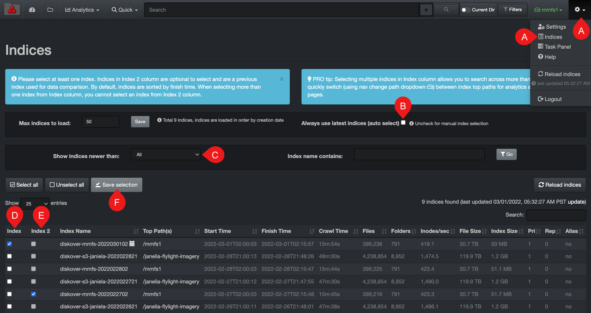

___
### Heatmap Report

&nbsp;&nbsp;&nbsp;

The heatmap report is a powerful analytical snapshot offering a differential comparison of two indices across two different points in time:

- Instant visual of location of data growth and shrinkage, as well as the absence of activity if no colors.
- Insightful for data curation efforts.
- Useful tool to monitor activity, ex: awaiting new project to be onboarded, monitor backups, etc.

The **red** and **green** colors in the heatmap report have meaning. All other colors are just a gradation between the red and the green.

> Red = Data growth
> 
> Green = Data shrinkage

The absence of colors in a heatmap report is also very meaningful, revealing data inertia, alerting you of possible anomalies. The lack of colors/activity is also a good indicator when comparing, for example, an on-premise server to a backup of that server in the cloud where you want data in both storage volumes to be identical; inertia in that case being favorable.

#### How to Select Indices for the Heatmap Report

Before accessing the heatmap report, you need to [select 2 indices from 2 different points in time](#index_selection). You will want to select the same index/storage volume name from both columns D & E in order to compare the same data.

>🔆 &nbsp;Sometimes, the storage volumes don’t need to have the same name to be compared. For example, a storage volume could be on a physical server with one name, and another storage volume could be a backup with the same data set in the cloud with a different name.

Here is a quick visual recap for heatmap purposes only:

A) From the gear icon drop-down list, select  **Indices**.

B) Deselect **Always use latest indices**.

C) Optional - you can select the aging of the indices you want to make available in the list.

D) Select one index from  **Index**  column.

E) Select one index from  **Index 2**  column, it should technically be the same storage volume name as in  **Index**  column, but from a previous date.

F) Click  **Save selection**.

>🔆 &nbsp;The tips in the blue info bars are practical for quick references.

#### Accessing the Heatmap Report

You need to select the [indices](#index_selection) to compare as explained above before accessing the report, otherwise you’ll get an error message.

Via the  **Analytics**  drop-down list for global results:

Via the results pane by clicking this icon to investigate a particular path.

#### Heatmap Overview

>🔆 &nbsp;Hovering over the graphics will give you a snapshot of their attributes.

A) **Path bar**: You can view as well as manually type in the [path](#path) you want to investigate.

B) **Go**: If you manually enter or edit a value in A) path bar, the  **Go**  button acts like a  **Return**  key.

C) **Up Level**: Will bring you one directory up per click until you reach the top of the volume.

D) **Reload**: To reload the chart and tree cache/data.

E) **Size Filter**: To select a minimum data size you want to pinpoint in the results.

F) **Mtime Filter**: To select a specific period when the data was last modified.

G) **Hide Thresh**: To make the graphics less busy by hiding the results with low percentages.

H) **Size or Count**: elect either you want to see the report by the  **Size**  of the data or **Count** of items.

I) **Maxdepth**: Select how many levels/directories deep you want the results to show.

J) **Show new dirs**: Leave unselected if you want to hide all the new directories that might have been created, as it can be misleading by adding a lot of red due to the fact that they are new. New directories can distract from the real changes you want to analyze OR it can be exactly what you are looking for.

K) **Show Files**: By default, the results pane will only show directories, select if you want to see files as well in the results pane.

L) **Filters**: Summary of the filters or preferences that you might have selected.

>🔆 &nbsp;Filters will stay active, even if you navigate away to another page.

M) **Items per page**: To modify the number of items per page (between 10 to 100).

N) **Search within page**: To refine your search for the current page only, it acts similarly as CTRL or CMD + F would, but will only leave the line items for which it finds a match:
  - You can enter more than one search word and/or numbers as per the above example.
  - This field will recognize or know what to do with [operators](#operators).
  - You do not need to use [wild cards](#wildcards) as this field will search on partial words or numbers.
  - You cannot use this field to search on [tags](#tags).
  - It will not search other pages if you have more than one page of results, nor will it search [recursively](#recursive).

O) **Results pane**: You can sort on a single column at a time by clicking the arrows in the headers.

P) **Show path in heatmap** **icon**: Will show the heatmap report for that particular [path](#path).

Q) **Search for path icon**: To open that [path](#path) in the search page.

R) **Navigation within pages of results**: To go back and forth if you have several pages of results.

#### Comparing Indices in the Search Page

You can compare indices in the search page as well. You will see red/growth or green/shrinkage status results:

