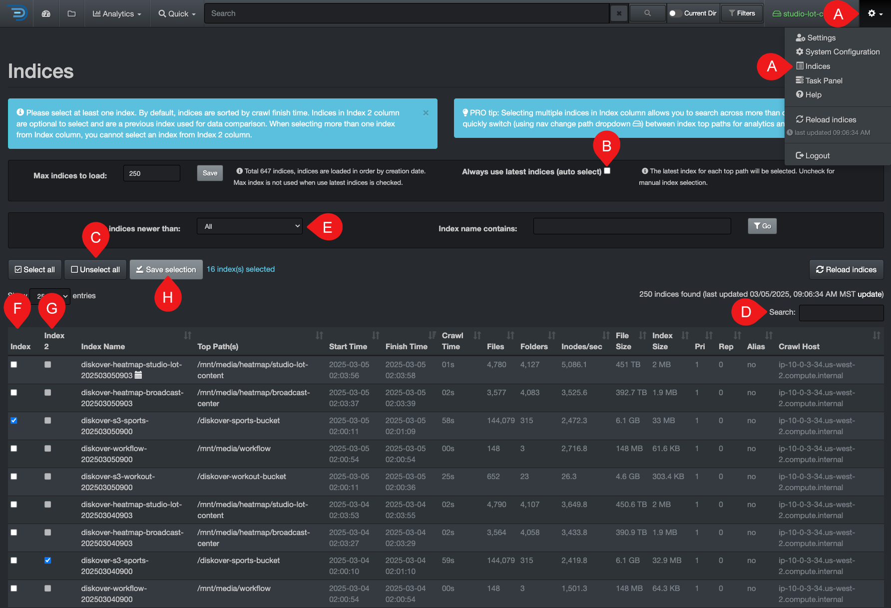

### Heatmap 

The heatmap report is a powerful analytical snapshot offering a differential comparison of two indices across two different points in time:

- An instant visual of the location of data growth and shrinkage:
  - **Red** = data growth
  - **Green** = data shrinkage
  - **No color** = the absence of color is meaningful—it indicates data inertia, which may signal anomalies—also useful for comparisons, such as ensuring a cloud backup matches an on-premise server.
- Insightful for data curation efforts.
- A useful tool to monitor activity, ex: awaiting new project to be onboarded, monitor backups, etc.

#### How to Select Indices for Heatmap

Before accessing the heatmap report, you need to [select 2 indices from 2 different points in time](#index_selection):

- You need to select the same index/volume name to compare the same data.
- For backups though, it makes sense to select different indices or volumes, such as comparing an on-premise index to a cloud index.

⚠️ These selections will stay active and affect all your future interactions until you return to this page and select 🅑 **Always use latest indices**.
 🔆 The tips in the blue help bars are very helpful!

| STEP | DESCRIPTION |
| :---: | --- |
| A | Click the ⛭ and select **Indices** |
| B | Deselect **Always use latest indices**. |
| C | Click **Unselect all** to ensure all indices are deselected. |
| D | OPTIONAL - You can filter your indices by searching with a keyword, only leaving the desired indices in your results. |
| E | OPTIONAL - You can filter your indices by aging to narrow down the list of indices in your results. |
| F | Select one index from  **Index**  column. |
| G | Select one index from  **Index 2**  column, with a different date. |
| H | Click  **Save selection**. |

#### Accessing Heatmap

⚠️ As explained above, you must select two indices for comparison, otherwise you will get an error message when trying to load the report.

| From the **Analytics** drop-down list | From the  located in the path column in the results pane |
| --- | --- |
|  |  |

#### Heatmap Overview

✏️ Hover over the graphics to view more detailed information.

| REFERENCE | DESCRIPTION |
| :---: | --- |
| A | **Path bar**: You can view and paste a path to investigate. |
| B | **Go**: That button acts as a  **RETURN**  key, for example, use if you paste a path in that bar. |
| C | **Up Level**: To drill up one directory at a time until you reach the top of the [volume](#volume). |
| D | **Reload**: To reload the cached data for the chart and file tree. |
| E |  **Size Filter**: To set a minimum data size threshold for filtering results. |
| F | **Min and Max Mtime Filters**: To focus on specific data modified time periods. |
| G | **Hide Thresh**: To make the graphics less busy by hiding the results with low percentages. |
| H | **Size or Count**: Choose whether to view the report by **Size** (data volume) or **Count** (number of items). |
| I | **Maxdepth**: Select the number of levels/directories to display in the results. |
| J | **Show new dirs**: Leave unselected if you want to hide all the new directories that might have been created, as it can be misleading by adding a lot of red because they are new. ✏️ New directories can distract from the real changes you want to analyze OR it can be exactly what you are looking for! |
| K | **Show Files**: By default, the results pane displays only directories—select this option to include files in the results. |
| L | **Filters**: Summary of the filters you might have selected. ⚠️These **filters will stay active**, even if you navigate away to other pages AND they will affect other analytics. |
| M | **Items per page**: To modify the number of items per page in the bottom results pane (between 10 to 100). |
| N |  **Search within page**: To refine your search for the current page only, it acts like CTRL or CMD + F, but it will only leave the line items for which it finds a match—the other line items are hidden and will reappear when you clear the search field. |
| O | **Results pane**: You can sort on a single column at a time by clicking the descending or ascending arrows in the headers. |
| P |  To launch the heatmap report for that particular [path](#path). |
| Q |  To open that [path](#path) in the [search page](#search_page).  Example of the delta you would see in the [search page](#search_page) when 2 indices from 2 different points in time are selected:  |

