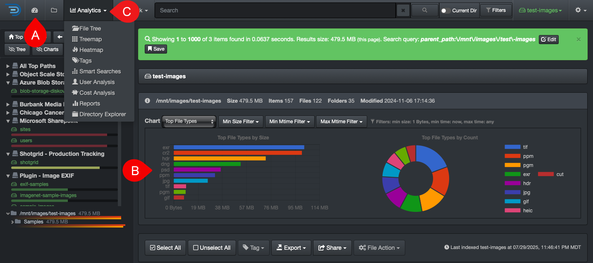

## Analytics

This chapter covers the various integrated analytics.

⚙️ Customizable analytics.

| | ANALYTIC | DESCRIPTION |
| --- | --- | --- |
| A | [Dashboard](#dashboard) | Snapshot of a volume with multiple clickable links to see the detailed results. |
| B | [Search Page Charts](#search_page_charts) | Snapshot of a path (aging, top files, top directories, etc.) refreshing with every click you make. |
| C | [File Tree](#filetree) | Instant profiling of directories by size and aging. |
| C | [Treemap](#treemap) | Displays hierarchical data using rectangles to represent the size of the directories. |
| C | [Heatmap](#heatmap) | Compares 2 indices from 2 points in time, giving an instant visual of data growth or shrinkage. |
| C | [Tags](#tags) | Analyze all your tagged datasets by name, size, and number. |
| C | [⚙️ Smart Searches](#smart_searches) | Customizable report tailored to what's relevant to your organization. |
| C | [User Analysis](#user_analysis) | Gives insights into data consumption and cost per user and group. |
| C | [⚙️ Cost Analysis](#cost_analysis) | Customizable report helping you put a price tag on the value of your digital assets. |
| C | [⚙️ Reports](#reports) | Customizable report to help you find your top unknowns. |
| C | [Directory Explorer](#directory_explorer) | Provides a visual breakdown of file size, age, and activity across your directory structure. |

### Search Page Charts 

Instant snapshot of a path—learn all about these nifty charts explained in the [Basic Usage | Search Page](#search_page_charts) chapter.
