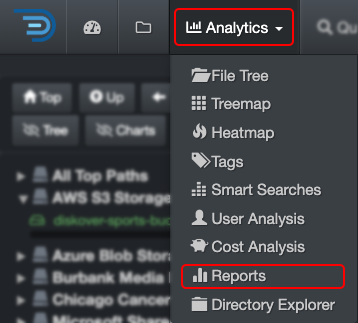

### Reports

Reports are designed to help you easily uncover your top unknowns—like reverse engineering for your data. With fully customizable queries tailored to what matters most to your business, you can quickly pinpoint hard-to-find files and key statistics. These reports are global and accessible to everyone in your organization.

#### Accessing Reports

| From the **Analytics** drop-down list | From the  located in the path column in the results pane |
| --- | --- |
| Will aggregate data from all volumes if no filters are activated.   | Will load the report for that path only.  |

#### Reports Overview

✏️ Hover over the graphics to view more detailed information.

| REFERENCE | DESCRIPTION |
| :---: | --- |
| A | Results by number of items – click on any link to open the results in the [search page](#search_page). |
| B | Results by size – click on any link to open the results in the [search page](#search_page). |
| C | Using the drop-down list, select what you want to investigate. |
| D | Using the drop-down list, select how many top results you want to see. |
| E | Apply filters to further customize your results:<ul><li>**Show files only**: Will exclude directories from the results.</li><li>**Show directories only**: Will exclude files from the results.</li><li>**Show all**: To show both files and directories in the results.</li><li>**Dir size no recurs**: To restrict results to a non-recursive directory search [non-recusrsive](#recursive).</li><li>**Current top path only**: To limit the results to 🅓 selected [volume](#volume).</li><li>**Current dir only**: If applicable, to limit the results to the path you selected in the search page and locked down via [Current Dir](#current_dir) before navigating to Reports.</li></ul> |
| F | Reports are global, if you want to narrow the results:<ul><li>To a single volume: Activate the **Current top path only** filter.</li><li>To a specific path: Activate the **Current dir only** filter as described in 🅒. |
| G | **Edit Reports**: You can view the queries used for the report, but editing them requires an admin account. If you need to add or edit a search query and don’t have admin access, contact your System Administrator. |

#### Customize Reports

Reports analytics includes sample queries out of the virtual box, but these [queries can be customized](https://docs.diskoverdata.com/diskover_setup_and_config_guide/#reports) by any user with an admin account.

