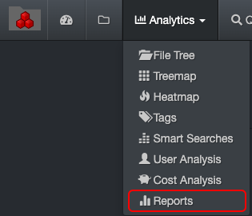
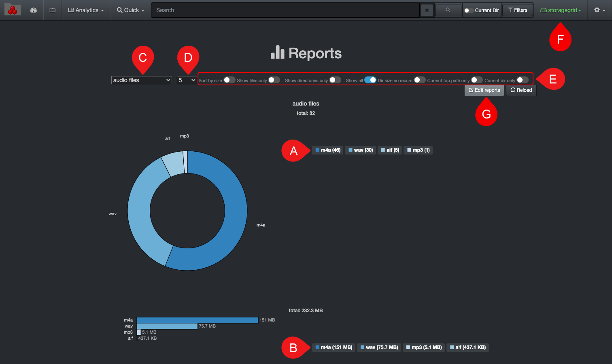

___
### Reports

&nbsp;&nbsp;&nbsp;

Reports were designed to easily help you find what you don't know; it's like reverse engineering. Fully customizable queries with what matters to your business, therefore for you to be able to quickly pinpoint those hard-to-find files and statistics. These reports are global and accessible to everyone in your organization.

#### Accessing Reports

Via the  **Analytics**  drop-down list for global results:

Via the results pane by clicking this icon to investigate a particular path.

#### Reports Overview

All saved reports can be found in this view offering a quick graphical snapshot:

A) Reports with results in number of items – click on a report to open the results in the search page. Those [sample queries can be customized](#reports_customize).

B) Same queries as A), but with results in size instead – click on a report to open the results in the search page.

C) Select what you want to investigate. Those [sample options can be customized](#reports_customize).

  

D) Select how many top results you want to see.

E) Apply filters to further customize your results:

  - **Sort by size**: Will sort by number of items by default, so activate to change to sorting by size.
  - **Show files only**: Will exclude directories from the results.
  - **Show directories only**: Will exclude files from the results.
  - **Show all**: To show both files and directories in the results.
  - **Dir size no recurs**: To limit directory size to [non-recursive](#recusrive).
  - **Current top path only**: To limit the results to F) selected [volume](#storage_volume).
  - **Current dir only**: If applicable, to limit the results to the path you selected in the search page and locked down via [Current Dir](#current_dir) before navigating to Reports.

F) Reports are global, if you want to narrow the results:
  - To a single volume > activate the **Current top path only** filter.
  - To a specific path > activate the **Current dir only** filter as described in E).

G) **Edit reports**: You can view the queries used for the report, but an admin account is required to edit them. If you have a search query that you’d like to add to the list and do not have an admin account, copy the full query/criteria and share it with your System Administrator.

#### How to Customize Reports

The Reports analytics comes with sample queries, but those [queries can be customized](https://docs.diskoverdata.com/diskover_configuration_and_administration_guide/#reports) by someone with and admin account.

The following report provides an example configured by **_order status_** when using the [Xytech Order Status Plugin](https://docs.diskoverdata.com/diskover_user_guide_companion_aja_media_edition/#xytech-order-status-plugin).
