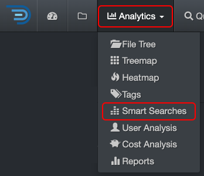
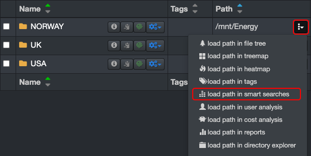
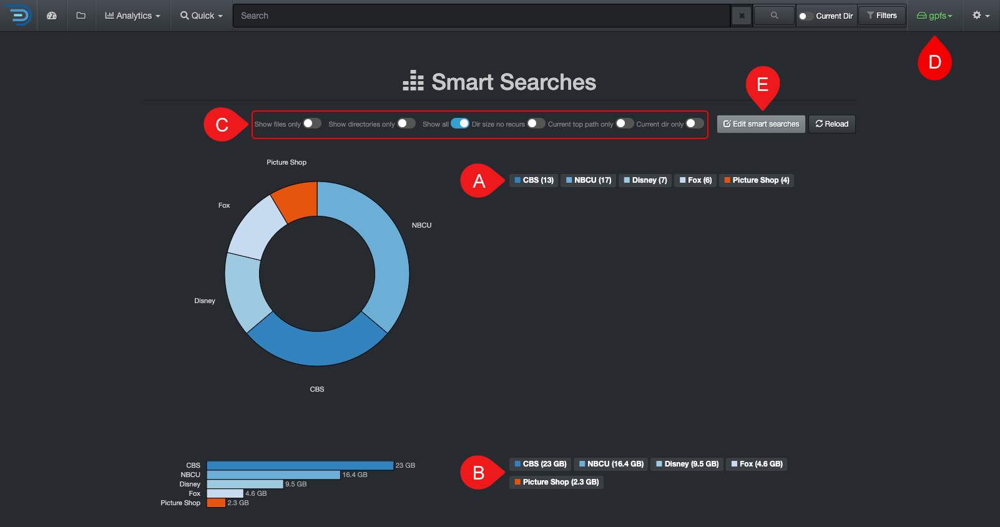
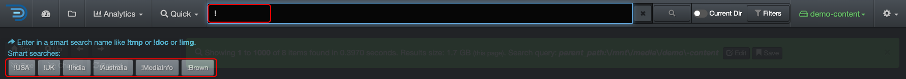

### Smart Searches

Fully customizable reports with what is relevant for your business (by customers, projects, clean up, storage tier, etc). Smart searches were designed for repeatable reports; they are basically saved searches. The goal is to avoid having to recreate complex queries when you know you will need the same report regularly. These reports are global and accessible by everyone in your organization.

#### Accessing Smart Searches

| From the **Analytics** drop-down list | From the  located in the path column in the results pane |
| --- | --- |
| Will aggregate data from all volumes if no filters are activated.   | Will load the report for that path only.  |

#### Smart Searches Overview

✏️ Hover over the graphics to view more detailed information.

| REFERENCE | DESCRIPTION |
| :---: | --- |
| A | Results by number of items – click on any link to open the results in the [search page](#search_page). |
| B | Results by size – click on any link to open the results in the [search page](#search_page). |
| C | Apply filters to further customize your results:<ul><li>**Show files only**: Will exclude directories from the results.</li><li>**Show directories only**: Will exclude files from the results.</li><li>**Show all**: To show both files and directories in the results.</li><li>**Dir size no recurs**: To restrict results to a non-recursive directory search [non-recusrsive](#recursive).</li><li>**Current top path only**: To limit the results to 🅓 selected [volume](#volume).</li><li>**Current dir only**: If applicable, to limit the results to the path you selected in the search page and locked down via [Current Dir](#current_dir) before navigating to Smart Searches.</li></ul> |
| D | Smart Searches are global, if you want to narrow the results:<ul><li>To a single volume: Activate the **Current top path only** filter.</li><li>To a specific path: Activate the **Current dir only** filter as described in 🅒. |
| E | **Edit Smart Searches**: You can view the queries used for the report, but editing them requires an admin account. If you need to add or edit a search query and don’t have admin access, contact your System Administrator. |

#### Launch Smart Searches Results from the Search Bar

You can launch a Smart Search report anytime directly from the search bar by typing **!**:
- A list of available reports will appear beneath the search bar
- Simply click on the desired report to view its results on the search page.

#### Customize Smart Searches

Smart Searches analytics includes sample queries out of the virtual box, but these [queries can be customized](https://docs.diskoverdata.com/diskover_setup_and_config_guide/#smart-searches) by any user with an admin account.
