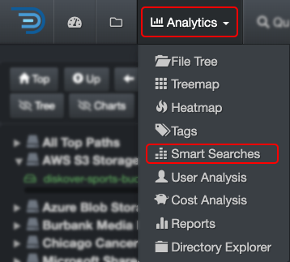

### Smart Searches

Fully customizable reports with what is relevant for your business (by customers, projects, clean up, storage tier, etc). Smart searches were designed for repeatable reports; they are basically saved searches. The goal is to avoid having to recreate complex queries when you know you will need the same report regularly. These reports are global and accessible by everyone in your organization.

#### Accessing Smart Searches

| From the **Analytics** drop-down list | From the  located in the Path column on the search page |
| --- | --- |
| Will aggregate data from all volumes if no filters are actived.   | Will load the report for that path only.  |

#### Smart Searches Overview

✏️ Hovering the graphic will give you more information.

| REFERENCE | DESCRIPTION |
| :---: | --- |
| A | Results by number of items – click on any link to open the results in the [search page](#search_page). |
| B | Results by size – click on any link to open the results in the [search page](#search_page). |
| C | Apply filters to further customize your results:<ul><li>**Show files only**: Will exclude directories from the results.</li><li>**Show directories only**: Will exclude files from the results.</li><li>**Show all**: To show both files and directories in the results.</li><li>**Dir size no recurs**: To limit results for the non-recursive directory to [non-recusrsive](#recursive).</li><li>**Current top path only**: To limit the results to D) selected [volume](#storage_volume).</li><li>**Current dir only**: If applicable, to limit the results to the path you selected in the search page and locked down via [Current Dir](#current_dir) before navigating to Smart Searches.</li></ul> |

D) Smart searches are global, if you want to narrow the results:
  - To a single volume > activate the **Current top path only** filter.
  - To a specific path > activate the **Current dir only** filter as described in C).

E) **Edit smart searches**: You can view the queries used for the report, but an admin account is required to edit them. If you have a search query that you’d like to add to the list and do not have an admin account, copy the full query/criteria and share it with your System Administrator.

#### Launch Smart Searches Results from the Search Bar

You can launch a smart search report at any time directly from the search bar by typing  **!**  and all the available reports will appear under the search bar, just click on the desired one to open the results of any report in the search page.

#### How to Customize Smart Searches

Those [sample queries can be customized](#smart_searches_customize).

The smart searches analytics comes with sample queries, but those [queries can be customized](https://docs.diskoverdata.com/diskover_configuration_and_administration_guide/#smart-searches) by someone with and admin account.
