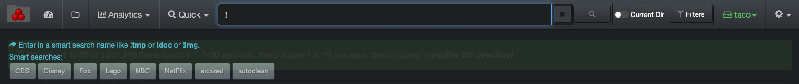

___
### Smart Searches

&nbsp;&nbsp;&nbsp;

Smart searches were designed for repeatable reports; they are basically saved searches or shortcuts. The goal is to avoid having to recreate complex queries when you know you will need the same report on a regular basis. These reports are global and accessible by everyone in your organization.

#### Accessing Smart Searches

Access via the  **Analytics**  drop-down list:

Via the search page by clicking this icon:

#### Smart Searches Overview

All saved reports can be found in this view offering a quick graphical snapshot:

A) Reports with results in number of items – click on a report to open the results in the search page. Those [sample queries can be customized](#smart_searches_customize).

B) Same queries as A), but with results in size instead – click on a report to open the results in the search page.

C) Apply filters to further customize your results:

  - **Show files only**: Will exclude directories from the results.
  - **Show directories only**: Will exclude files from the results.
  - **Show all**: To show both files and directoreis in the results.
  - **Dir size no recurs**: To limit directory size to [non-recusrsive](#recusrive).
  - **Current top path only**: To limit the results to D) selected [volume](#storage_volume).
  - **Current dir only**: If applicable, to limit the results to the path you selected in the search page and locked down via [Current Dir](#current_dir) before navigating to Smart Searches.

D) Smart searches are global, if you want to narrow the results:
  - To a single volume > activate the **Current top path only** filter.
  - To a specific path > activate the **Current dir only** filter as described in C).

E) **Edit smart searches**: You can view the queries used for the report, but an admin account is required to edit them. If you have a search query that you’d like to add to the list and do not have an admin account, copy the full query/criteria and share it with your System Administrator.

#### Launch Smart Searches Results from the Search Bar

You can launch a smart search report at any time directly from the search bar by typing  **!**  and all the available reports will appear under the search bar, just click on the desired one to open the results of any report in the search page.

#### How to Customize Smart Searches

The smart searches analytics comes with sample queries, but those [queries can be customized](https://docs.diskoverdata.com/diskover_configuration_and_administration_guide/#smart-searches) by someone with and admin account.
