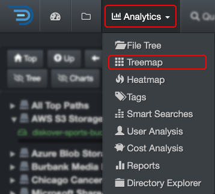
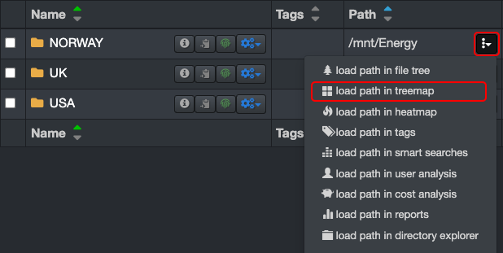
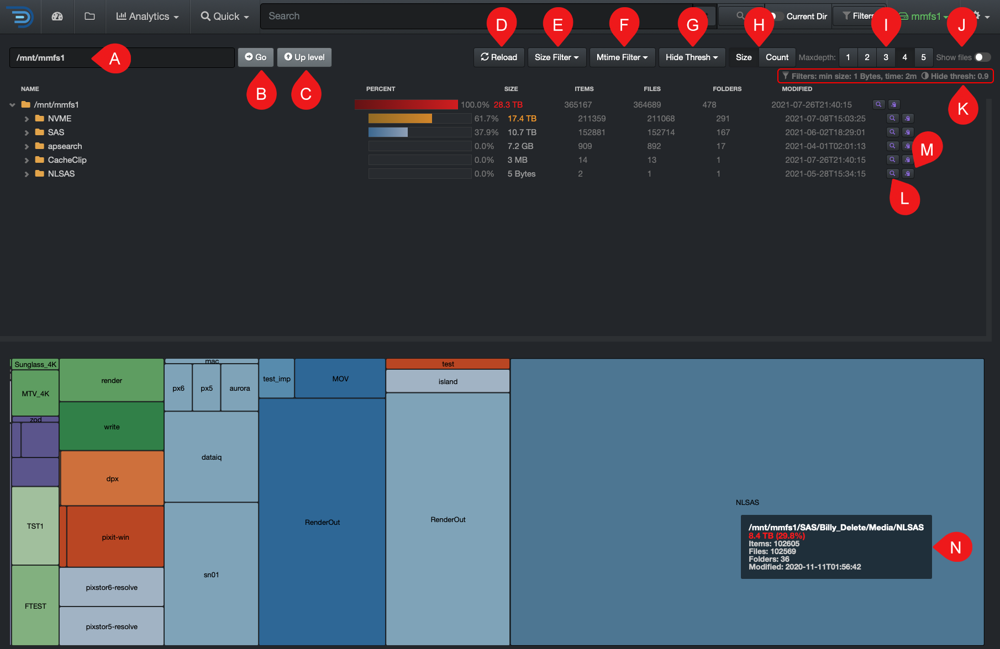

### Treemap

The treemap report visualizes hierarchical data using nested figures—the larger the rectangle, the more data the directory or file contains. This provides a graphical representation of folder sizes.

#### Accessing Treemap

| From the **Analytics** drop-down list | From the  located in the path column in the results pane |
| --- | --- |
| Will aggregate data from all volumes if no filters are activated.   | Will load the report for that path only.  |

#### Treemap Overview

✏️ Hover over the graphics to view more detailed information.

| REFERENCE | DESCRIPTION |
| :---: | --- |
| A | **Path bar**: You can view and paste a path to investigate. |
| B | **Go**: That button acts as a  **RETURN**  key, for example, use if you paste a path in that bar. |
| C | **Up Level**: To drill up one directory at a time until you reach the top of the [volume](#volume). |
| D | **Reload**: To reload the cached data for the chart and file tree.
| E | **Size Filter**: To set a minimum data size threshold for filtering results. |
| F | **Mtime Filter**: To focus on a specific data modified time period. |
| G | **Hide Thresh**: To make the graphics less busy by hiding the results with low percentages. |
| H | **Size or Count**: Choose whether to view the report by **Size** (data volume) or **Count** (number of items). |
| I | **Maxdepth**: Select the number of levels/directories to display in the results. |
| J | **Show Files**: By default, the results pane displays only directories—select this option to include files in the results. |
| K | **Filters**: Summary of the filters you might have selected. ⚠️These **filters will stay active**, even if you navigate away to other pages AND they will affect other analytics. |
| L |  Click to open that path in the [search page](#search_page) for further investigation. |
| M |  To copy the path to your clipboard. |
| N | **Graphics area**: You can drill down using the rectangles. ✏️ All rectangles of the same color belong to the same directory. |
