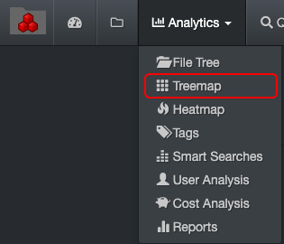

___
### Treemap

&nbsp;&nbsp;&nbsp;&nbsp;&nbsp;&nbsp;&nbsp;&nbsp;

The treemap report displays hierarchical data using nested figures. Diskover opted for rectangles; the bigger the rectangle the more data is contained in that directory or file. It graphically represents the size of folders, candidates for cleanup, aging, etc.

#### Accessing the Treemap Report

Via the  **Analytics**  drop-down list for global results:

Via the results pane by clicking this icon to investigate a particular path.

#### Treemap Overview

>🔆 &nbsp;The colors in this report have a meaning. All rectangles with the same color are part of the same directory.

>🔆 &nbsp;Hovering over any rectangles will give you a snapshot of their attributes.

A) **Path bar**: You can view as well as manually type in the path you want to investigate.

B) **Go**: If you manually edit a value in A) path bar, the  **Go**  button acts as a  **Return**  key.

C) **Up Level**: Will bring you one directory up per click until you reach the top of the volume.

D) **Reload**: To reload the chart and tree cache/data.

E) **Size Filter**: To select a minimum data size you want to pinpoint in the results.

F) **Mtime Filter**: To select a specific period when the data was last modified.

G) **Hide Thresh**: To make the graphics less busy by hiding the results with low percentages.

H) **Size or Count**: Select whether you want to see the report by the  **Size**  of the data or **Count** of items.

I) **Maxdepth**: Select how many levels/directories deep you want the results to show.

J) **Show Files**: By default, the results will only show directories, select if you want to see files as well.

K) **Filters**: Summary of the filters or preferences that you might have selected.

>🔆 &nbsp;Filters will stay active, even if you navigate away to another page.

L) **Magnifying glass icon**: Click to open the directory and its file in the search page for further investigation.

M) **Copy path icon**: To copy the path of a file or directory to your clipboard.

N) **Graphics area**: You can drill down by clicking on the rectangles.
