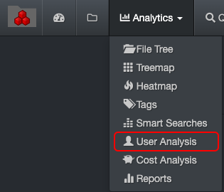
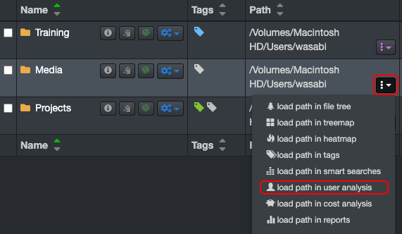
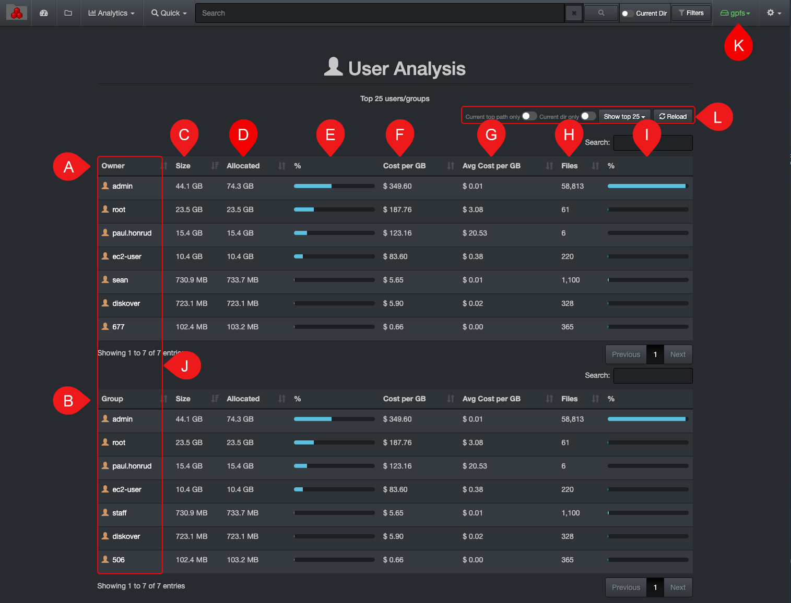

___
### User Analysis 

&nbsp;&nbsp;&nbsp;&nbsp;&nbsp;&nbsp;&nbsp;&nbsp;

The user analysis report gives a snapshot of data utilization by user or by group of users; it was designed to help with operating costs  management, as well as customers’ storage consumption for billing accuracy. The owner/group value in Diskover is populated from your organization's Filesystem assigned owner and group.

This report needs to be enabled and configured by your System Administrator.

#### Accessing the User Analysis Report

Via the  **Analytics**  drop-down list for global results:

Via the results pane by clicking this icon to investigate a particular path.

#### Using the User Analysis Report

A) **Owner**: The owner/creator of a file. This report is configured by your System Administrator who may also have used a storage volume in place of a person/owner.

B) **Group**: A group might include several owners (ex: a department) and is configured by your System Administrator.

C) **Size**: Total data size under an owner or a group.

D) **Allocated**: The actual size that the files are occupying can be helpful for [charging storage costs accordingly to clients](#cost_analysis).

E) **% Allocated**: Owner’s storage space usage divided by the total of all owners or groups.

F) **Cost per GB**: Total cost for the space used by an owner or a group, shares the same [storage cost calculation](#cost_config) as for the [cost analysis report](#cost_analysis).

&nbsp;&nbsp;&nbsp;&nbsp;&nbsp;&nbsp;

G) **Avg cost per GB**: The average cost by GB for that owner or group. The cost depends on how each storage volume was configured by your system administrator.

&nbsp;&nbsp;&nbsp;&nbsp;&nbsp;&nbsp;

H) **Files**: Number of files linked to the owner or group.

I) **% File**: Files linked to the owner or group divided by the total of files of all owners or groups.

J) **Clickable links**: Click on any of the names under  **Owners**  or  **Groups**  to access the results in the file search page.

K) The user analysis  report is global for all volumes, selecting any of these options will not affect the results.
  - To narrow the results to a specific path, use the L) filters.
  - If you want to narrow the results to one or more specific volumes, select the desired volume(s) in the [indices](#index_selection) page and navigate back to this report.

L) Apply filters to further customize your results:
  - **Current top path only**: To limit the results to K) selected [volume](#storage_volume).
  - **Current dir only**: If applicable, to limit the results to the path you selected in the search page and locked down via [Current Dir](#current_dir) before navigating to User Analysis.
  - **Show top 25**: To show the top 10 to 10,000, default is 50.
  - **Reload**: To reload/refresh the data if needed.
