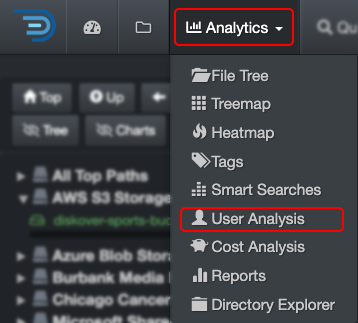

### User Analysis 

The user analysis report provides a snapshot of data utilization by individual users or groups. It helps manage who's using the storage space, as well as operating costs. This report must be enabled and configured by your System Administrator.

#### Accessing User Analysis

| From the **Analytics** drop-down list | From the  located in the path column in the results pane |
| --- | --- |
| Will aggregate data from all volumes if no filters are activated.   | Will load the report for that path only.  |

#### Using the User Analysis Report

✏️ Hover over the graphics to view more detailed information.

| REFERENCE | DESCRIPTION |
| :---: | --- |
| A | **Owner**: Aligns with the authentication method in use. It relies on user metadata from the configured authentication system (e.g., LDAP, Active Directory, or other identity providers) to track data utilization by users or groups. However, proper configuration is required to ensure accurate reporting, and access may depend on the permissions set by your System Administrator. |
| B | **Group**: Aligns with the authentication method in use. It relies on user metadata from the configured authentication system (e.g., LDAP, Active Directory, or other identity providers) to track data utilization by users or groups. However, proper configuration is required to ensure accurate reporting, and access may depend on the permissions set by your System Administrator.  |
| C | **Size**: Total data size under an owner or a group. |
| D | **Allocated**: The actual size that the files are occupying, can be helpful for [charging storage costs accordingly](#cost_analysis). |
| E | **% Allocated**: Owner or group storage space usage divided by the total of all owners or groups. |
| F | **Cost per GB**: Total cost for the space used by an owner or a group, shares the same [storage cost configuration](#cost_config) as the [cost analysis report](#cost_analysis). |
| G | **Avg cost per GB**: The average cost by GB for that owner or group. |
| H | ** File**: The number of files linked to an owner or group. |
| I | **% File**: The number of files assigned to an owner or group, divided by the total number of files across all owners or groups. |
| J | Click on any of the names under  **Owner**  or  **Group**  to access the results in the [search page](#search_page). |
| K | The user analysis  report is global for all volumes, selecting any of these options will not affect the results:<ul><li>To narrow the results to a specific path, use the 🅛 filters.</li><li>If you want to narrow the results to one or more specific volumes, select the desired volume(s) in the [indices](#index_selection) page and navigate back to this report. |
| L | Apply filters to further refine your results:<ul><li>**Current top path only**: To limit the results to the selected [volume](#volume).</li><li>**Current dir only**:  If applicable, to limit the results to the path you selected in the search page and locked down via [Current Dir](#current_dir) before navigating to User Analysis.</li><li>**Show top X**: Select your preference to show from top 10 to 10,000, default is 50.</li><li>**Reload**: To reload/refresh the data if needed. |
