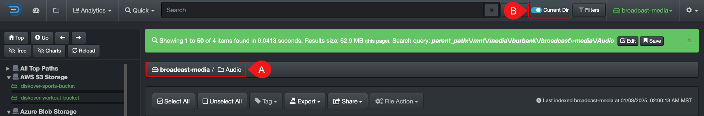

### Limit Searches to a Specific Path

Diskover searches all your indexed [volumes](#volume) and their directories at all times, but you can limit your searches to a specific path by using the **Current Dir** toggle button if needed.

| REFERENCE | DESCRIPTION |
| :---: | --- |
| A | Drill down into the specific path you want to use to refine your search results. |
| B | Activate the **Current Dir** toggle button → **gray** is inactive and **colored** is active. ⚠️ This selection will remain active until you go back and manually deactivate the toggle button. |

### Limit Searches to a Specific Index

There are different options depending on what you are trying to find.

- **Search latest indexed data/volume**: You can limit your searches by simply using [**Current Dir**](#current_dir).
- **Search older indexed data/volume**: You can select a specific index/volume by following the instructions in the [**indices**](#indices) section. 
