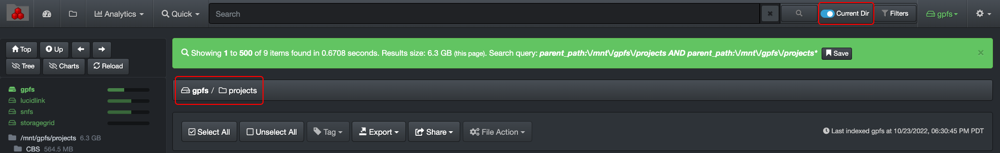

___
### Limit Searches to a Specific Path
___

Diskover searches all your [volumes](#storage_volume) and their directories at all time, either your data is in the cloud or on-premise. 

If needed, you can limit your searches to a specific path, and using the **Current Dir** toggle button.

- Once you've selected the particular path (volumes and/or directory) which you want to use to narrow your searches, activate the **Current Dir** toggle button. 
- Be aware that this selection will remain active until you go back and deactivate the toggle button.

### Limit Searches to a Specific Index

- You can **select a specific index** following the instructions in the [indices section](#indices) of this guide. Be aware that this selection will remain active until you go back and reselect **Always use latest indices**.
