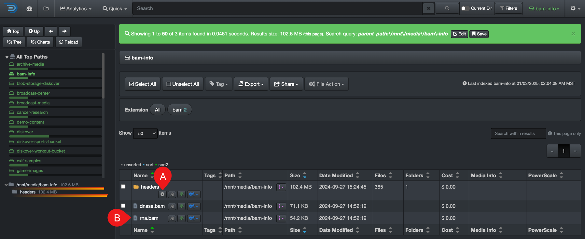
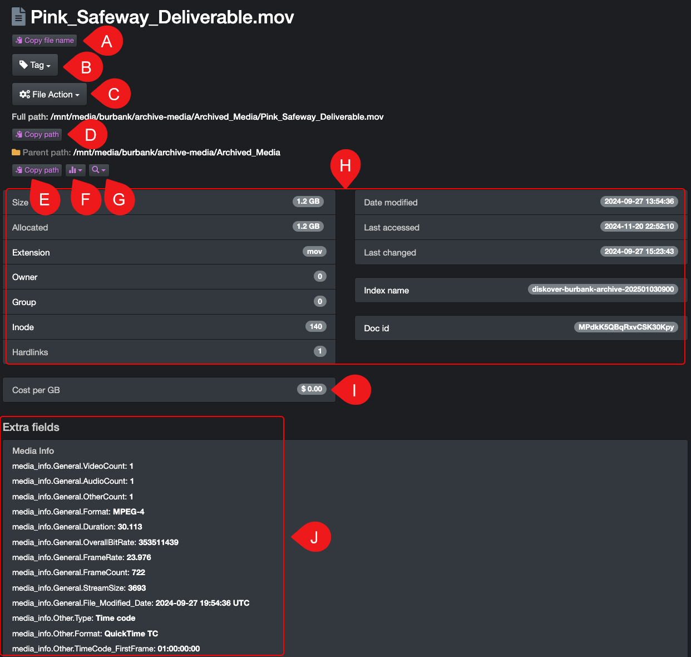

___
### Detailed Attributes/Metadata

The process is slightly different if you want to refer to the attributes of a directory or a file. In both cases, though, a new tab will open with the detailed [metadata](#search_field_names) configured and harvested for your instance.

| REFERENCE | DESCRIPTION |
| :---: | --- |
| A | **Open detailed metadata for a Directory**: click this icon  in line with a directory. |
| B | **Open detailed metadata for a file**: click directly on a file name. |

| REFERENCE | DESCRIPTION |
| :---: | --- |
| A | To copy the file name only to your clipboard. |
| B | To apply a [tag](#tags) to the current file or directory, and if applicable, this area would also display the current tag(s) applied to this file or directory. |
| C | To launch a [file action](#file_action) for the current file or directory. |
| D | To copy the current path, including the file name, to your clipboard. |
| E | To copy the current path, without the file name, to your clipboard. |
| F | To load the parent path in any of the proposed [analytics](#analytics). |
| G | To search the parent path [recursively or non-recursively](#recursive). |
| H | Detailed base metadata harvested during indexing. ✏️ Each of these fields can be individually searched using [field names for basic metadata](#base_metadata). |
| I | Displays the file or directory cost when the [feature](#cost_analysis) is enabled. |
| J | If applicable for your instance, this section displays any extra metadata indexed using Diskover's metadata harvest plugins. ✏️ Each of these fields can be individually searched using [field names for extra metadata](#extra_metadata). |

