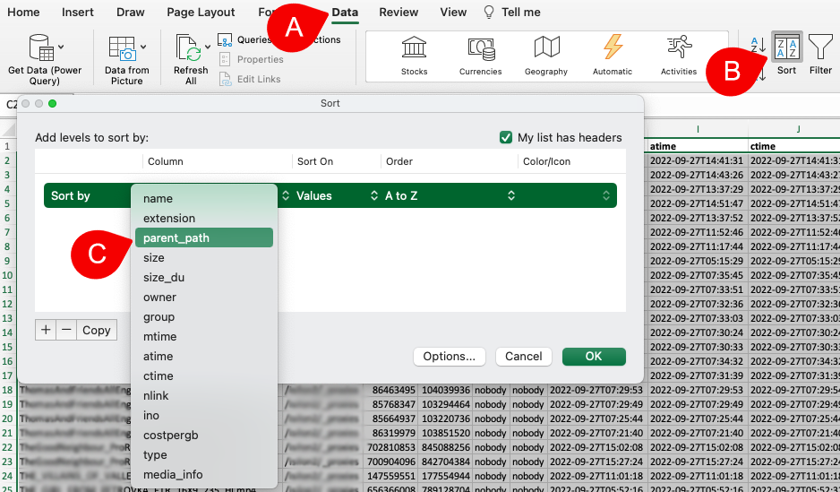
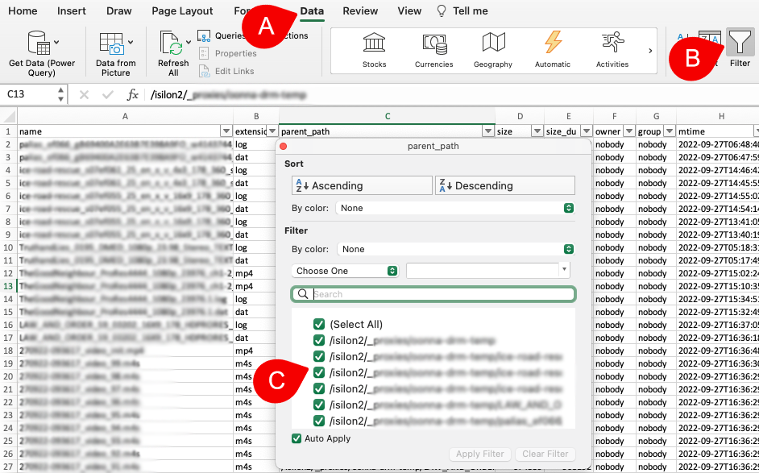
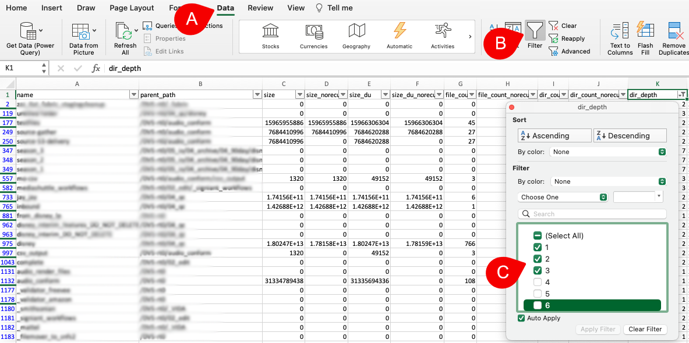

### Data Manipulation in Excel

#### [🍿 Watch Quick Tips | Recursive Search, Export, and Excel Manipulation](https://vimeo.com/762454710)

#### Export Directories and/or Files to Excel

Refer to the **[export](#export)** section of this guide to learn how to export to a **CSV** format.

#### Multiple Path/Directory Levels Manipulation in Excel

When exporting data in **CSV** format, all metadata associated with a file or directory is included in multiple columns. This allows you to use Excel's **Sort** and **Filter** functions to quickly find the specific data you need.  

##### Excel → Data → Sort

Once you export the desired data to a **csv** format, open that file with Excel.

| REFERENCE | DESCRIPTION |
| :---: | --- |
| A | From the Excel application menu, select **Data**. |
| B | Click the **Sort** icon. |
| C | Select **parent_path** to sort by path/directories:<ul><li>You can add multiple levels of column sort by clicking on the **+** sign.</li><li>The same **Data → Sort** selection can also be accessed from Excel's top drop-down menu.</li><li>Refer to **Excel → Help** menu for further instructions.</li></ul> |

##### Excel → Data → Filter → When Exporting _Files_ from Diskover

After you [export](#export) **files** from Diskover in **CSV** format, open the file in Excel.  

| REFERENCE | DESCRIPTION |
| :---: | --- |
| A | From the Excel application menu, select **Data**. |
| B | Click on the **Filter** icon. |
| C | Click on the **down-arrow** in the **parent_path** column which will open a window with multiple options:<ul><li>Select the path(s) you want to isolate in your results and click **Apply Filter**.</li><li>The same **Data → Filter** selection can also be accessed from Excel's top drop-down menu.</li><li>Refer to **Excel → Help** menu for further instructions.</li></ul> |

##### Excel → Data → Filter → When Exporting _Directories_ from Diskover

The same instructions apply when you [export](#export) **directories** from Diskover, but the results will include additional columns, providing more filtering options.  

| REFERENCE | DESCRIPTION |
| :---: | --- |
| A | From the Excel application menu, select **Data**. |
| B | Click on the **Filter** icon. |
| C | Instead of clicking on the **down-arrow** in the **parent_path** column, click the down-arrow from the **dir_depth** column, which will open a window with multiple options:<ul><li>Select the depth of sub-directory(ies) you want to isolate in your results and click **Apply Filter**.</li><li>The same **Data → Filter** selection can also be accessed from Excel's top drop-down menu.</li><li>Refer to **Excel → Help** menu for further instructions.</li></ul> |

✏️ _In Excel, you can use both **Sort** and **Filter** simultaneously to refine and display the results you need._ 

