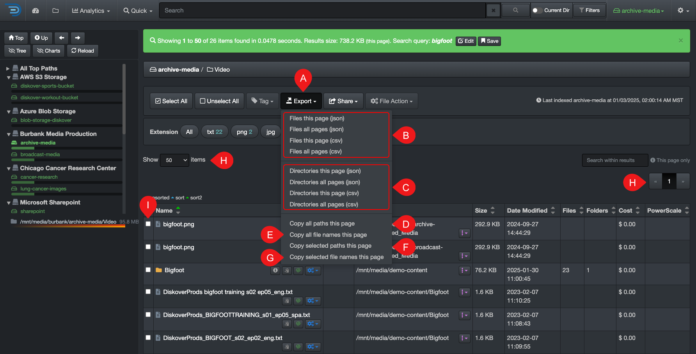

### Export 

Whether your results come from drilling down the file tree or from a search, you can export them and copy paths to your clipboard. Let's explore the options.  

| REFERENCE | DESCRIPTION |
| :---: | --- |
| A |  **Export** drop-down list. ⚠️ We recommend limiting your exports to 100,000 line items - if you try to export more than 100,000 items:<ul><li>The export will probably go through, but you will get a warning message.</li><li>The process may take several minutes to hours, depending on how many line items you're trying to export.</li><li>Note that Excel has a maximum of 1 million lines.</li><li>If you are a client, please have your System Administrator open a [support ticket](https://support.diskoverdata.com/) if you are encountering issues with exporting a large number of line items.</li></ul> |
| B | **Export Files**:  use these options only if you have files in your results, otherwise, the report will be empty:<ul><li>✏️ Will export all the [metadata](#attributes) attached to the files.</li><li>**CSV or JSON**: available formats for export.</li><li>Will disregard if you have 🅘 selected items.</li><li>**Files this page**: to export only the files on 🅗 this page. **Files all pages**: to export files from 🅗 all pages.</li><li>The exported file will automatically go to your **download folder** and will look something like this, including the export timestamp: `diskover_export_file_250303_104938.csv`</li></ul> |
| C | **Export Directories**: use these options only if you have directories in your results, otherwise, the report will be empty:<ul><li>✏️ Will export all the [metadata](#attributes) attached to the directories.</li><li>**CSV or JSON**: available formats for export.</li><li>Will disregard if you have 🅘 selected items.</li><li>**Directories this page**: to export only the directories on 🅗 this page. **Directories all pages**: to export directories from 🅗 all pages.</li><li>The exported file will automatically go to your **download folder** and will look something like this, including the export timestamp: `diskover_export_file_250303_104938.csv`</li></ul> |
| D | **Copy all paths this page**: copy to your clipboard all paths listed on 🅗 the current page, either they are files or directories, and will disregard if you have selected items. |
| E | **Copy all file names this page**: copy all file names to your clipboard only, not the path, listed on 🅗 the current page and will disregard if you selected items. |
| F | **Copy selected paths this page**: copy all paths of the 🅘 [selected files and/or directories](#item_selection) to your clipboard. |
| G | **Copy selected file names this page**: copy all paths of the 🅘 [selected files ](#item_selection) to your clipboard. |
| H | **Items per page and number of pages**: may affect some of the export options as explained above - click here to learn more about [items per page options](#items_per_page). | 
| I | **Selection**: may affect some of the export options as explained above - click here to learn more about [selecting items](#item_selection). |
