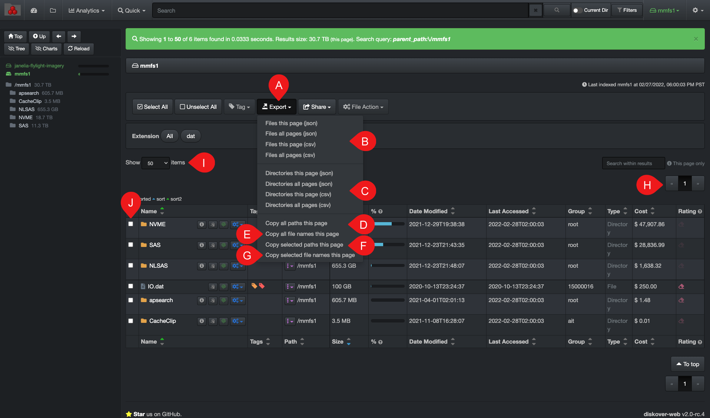

___
### Export Search Results

From the search page, you can export the list of paths resulting from a search, or from looking into a storage volume or directory.

A) **Export**  drop-down list button.

B) To export  **files**  only if you have files in your results, otherwise the report will be empty. This method will export the file names, paths, as well as the information contained in the various columns allowing for easy sorting in Excel for example.

&nbsp;&nbsp;&nbsp;&nbsp;

>- The export file will automatically go to your  **Downloads**  folder and will display all the columns/info as you see them in your result pane.
>- **This page**: Chose to export only the files showing on H) this page. The number of H) pages is affected by the number of search results and I) items per page.
>- **All pages**: Chose to export the files showing in H) all pages.
>- **json** or  **csv**: Chose the preferred export format for your results.

C) To export  **directories**  only if you have directories in your results, otherwise the report will be empty. This method will export the directory names, paths, as well as the information contained in the various columns allowing for easy sorting in Excel for example.

&nbsp;&nbsp;&nbsp;&nbsp;

>- The export file will automatically go to your  **Downloads**  folder and will display all the columns/info as you see them in your result pane.
>- **This page**: Chose to export only the directories showing on H) this page. The number of H) pages is affected by the number of search results and I) items per page.
>- **All pages**: Chose to export the directories showing in H) all pages.
>- **json**  or  **csv**: Chose the preferred export format for your results.

D) **Copy all paths this page**: Will copy to your clipboard all paths listed on H) the current page, either they are files or directories.

E) **Copy all file names this page**: Will copy to your clipboard all file names only, not the path, listed on H) the current page.

F) **Copy selected paths this page**: Will copy to your clipboard all paths, either files or directories, that you have selected in J) column.

G) **Copy selected file names this page**: Will copy to your clipboard all file names only, not the path, that you have selected in J) column.
