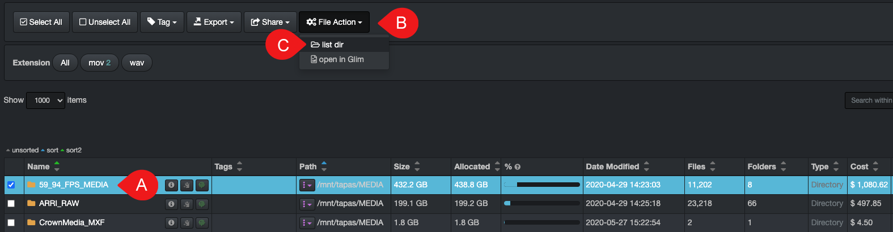

#### File Action - Live View Into Directory(ies) Pre-Indexing

&nbsp;&nbsp;

When you are not finding a file/directory in the indexed volumes, you can access the live directory and see if the files you are waiting to be onboarded will be available during the next indexing, as well as preemptively copy the links for a work order.

This feature needs to be enabled by your System Administrator.

A) Select one or multiple directories in the results pane.

B) Click the **File Action** icon.

C) Select **list dir**.

- This will give you a list of the file/directories in the live directory which will be indexed during the next scheduled task.
- You can search using CTRL F for Windows or COMMAND F for Mac.
- This view allows you to preemtively copy paths if needed, although you can only copy them one by one if they are random and not in a block.
