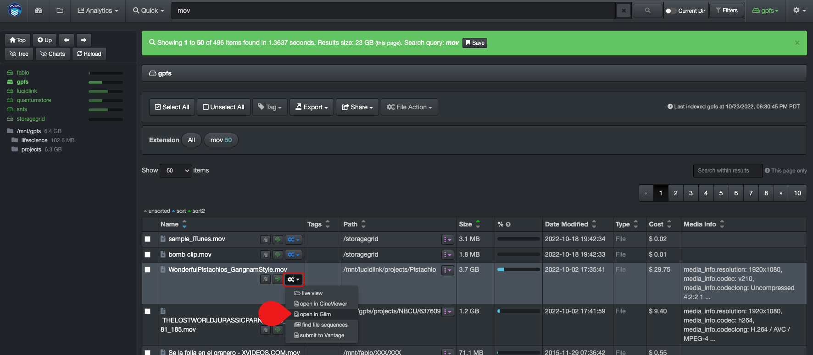
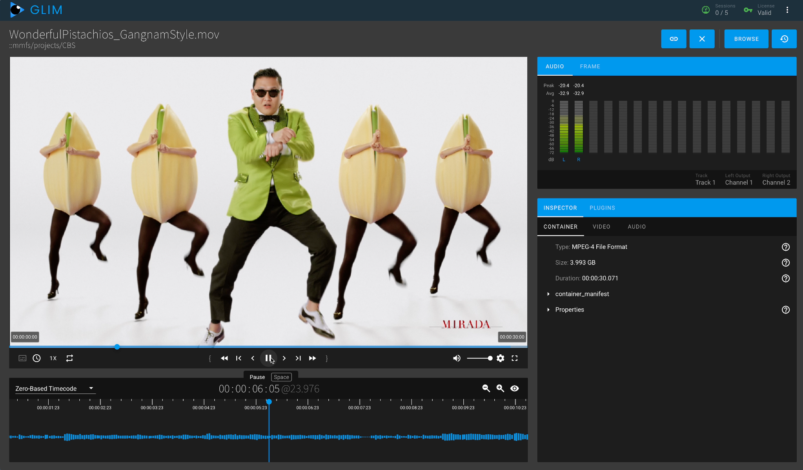

___
### File Action

This feature needs to be enabled by your System Administrator.

A) You need to select files and/or directories before using C) **File Action** button.

B) If you want to apply **File Action** to a single item, you can use the gear icon to do so.

C) Click **File Action** once you've A) selected items.

D) **list dir** > Gives you a live view into the director(ies) pre-indexing, see details below.

E) **open in Glim** > To preview media using Telestream GLIM, see details below.

F) **find file sequences** > To find all files in a sequence, see details below.

#### Live View Into Directory(ies) Pre-Indexing > list dir

&nbsp;&nbsp;

When you are not finding a file/directory in the indexed volumes, you can access the live directory and see if the files you are waiting to be onboarded will be available during the next indexing, as well as preemptively copy the links for a work order.

- Select one or multiple directories in the results pane.
- Click the **File Action** icon.
- Select **list dir**.

- This will give you a list of the file/directories in the live directory which will be indexed during the next scheduled task.
- You can search using CTRL F for Windows or COMMAND F for Mac.
- This view allows you to preemtively copy paths if needed, although you can only copy them one by one if they are random and not in a block.

#### Preview Media with Telestream GLIM > open in Glim

You can do an advanced search of media and playback right from Diskover.

The easiest way is to click the gear icon by the file you want to preview with GLIM > select **open with Glim**

This will launch GLIM where you'll be able to validate/preview the file.

#### Find All Files in a Sequence > find file sequences

&nbsp;&nbsp;

