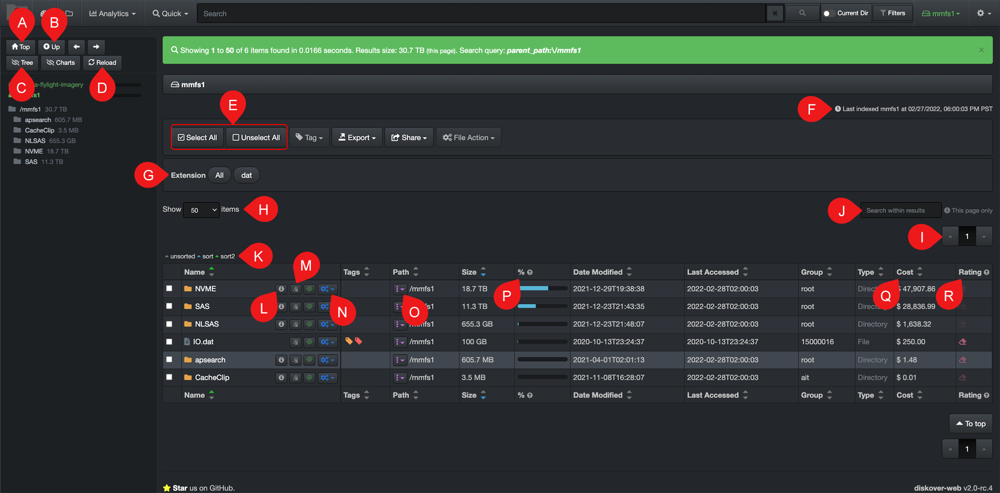
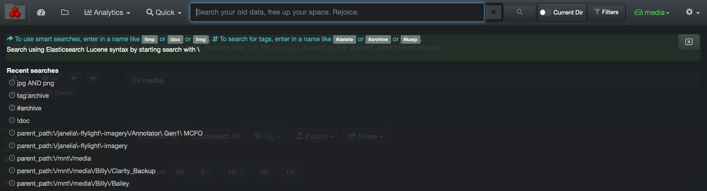

___
### Basic File Search

#### Accessing the Search Page

A) Click the **folder icon** to access the file search page, this will be the view by default.

B) **Charts hide/unhide**: The file search page displays colorful charts at the top of the page giving useful statistics about your top directories, as well as the top files in the selected storage volume. If you do not wish to see the charts, click the **Charts**  icon.

#### Main Features of the Search Page

It is preferable to use the back and forward buttons on your web browser to navigate between pages you have already visited. You can also use the back and forward buttons on the left pane of the file search window, but they are not always responsive depending on which browser you are using.

>🔆 You can [hide/unhide columns](#hide_columns) via your settings.

A) **Top**: To go back to the top of the storage volume.

B) **Up**: To go up one directory at a time.

C) **Tree hide/unhide**: To hide the left pane (storage volumes & directories) under this group of icons and expand the search results pane for more visibility within the columns.

D) **Reload**: To reload the chart and the tree data.

E) To  **Select All** or **Unselect All**  the directories and/or files results on the current page only.

F) **Storage volume last indexed**: Gives the date and time of the last scan of the selected storage volume. That information can also be viewed while hovering over a storage volume in the left pane.

G) **Extension**: Status bar displaying the file extensions and number of each type were found in the current search/selection.

H) **Items per page**: To modify the number of items per page – choice of 10 to 1,000.

I) **Pages of Results**: The number of pages of results is directly related to H).

J) **Search within results**: To refine your search for the current page only:
>- You can only search with letters or numbers; it will not accept [operators](#operators) or other special characters.
>- You cannot search on [tags](#tags).
>- You cannot and do not need to use the **\***  as this field will search on partial words or numbers,
>- It will not search inside the directories, only the results displayed on the page you are viewing.

K) **Sort legend**: You can do a primary and secondary sort on any columns, ascending or descending, using the arrows beside the headers.

L) **Info icon:** Will display the directory’s attributes by opening a new page.

M) **Copy Path icon**: To copy and share the path of a file or directory. The path syntax is specific to your Operating System and setup by the System Administrator, but can also  be modified in your [settings](#path_translation).

N) **Reports icon**:  Drop-down list  allowing you to load this path directly in [file tree](#filetree), [treemap](#treemap) or [heatmap report](#heatmap). Drop-down list also give you the option to search that path [recursively or non-recursively](#recursive).

O) **%**: Percentage size of the current path compared to the total size of the volume/directory you're in.

P) **Cost**: Storage cost for this path, cost calculation is explained in the [cost analysis](#cost_analysis) section.

Q) **Rating**: Is based on the last modified time, the older the higher the rating and the brighter the icon.

>🔆 You can right-click an item in the search results pane to access other opening/sharing features. Those are associated with the browser you are using, not Diskover, so the choices and results may differ per browser and are not supported by Diskover.

<h4 id="file_attributes">Directory and File Attributes View</h4>

Page opening when clicking on  info icon  beside a directory or by clicking directly on a file.

A) To copy the file name only, not the whole path, to your clipboard.

B) Copy the current path including the file name to your clipboard.

C) Allows you to directly load this path in [file tree](#filetree), [treemap](#treemap) or [heatmap report](#heatmap).

D) Allows you to search that path [recursively or non-recursively](#recursive).

E) You can apply a [tag](#tags) to the current file or directory from this window, as well as see the tags that might already be applied.

F) Not in function yet, stay tuned!

#### Recent Searches

When you click in the search bar, a dark grey overlay rectangle will appear under it and show your most recent searches and/or the most recent storage volumes/directories you’ve visited. You can click on any of the most recent searches if you want to reuse the same query.

You can also find tips, see blue font, for search query examples right under the search bar.

#### No Items Found

When no items are found during a search, a blue info bar will appear. Use the links in that bar to navigate from there.

A) **Anything**: Will open a fresh file search page and allow you to start a new search.

B) **Help**: Will bring you directly to the user interface help page for search query examples and support.

C) **Reset sort order**: Resets search order for results, more useful for System Administrators.

D) **Go back**: Will bring you back to the previous page and allow you to modify your query, it has the same effect as clicking the back button in your browser.
