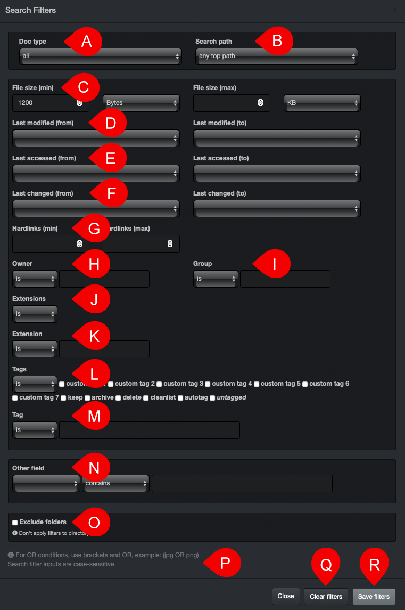

___
### Built-In Tool | Filters

Using the built-in filters is an easy way to start getting acquainted with Diskover, as well as get quick and accurate results. Using the filters add a layer of criteria to your searches without you having to type in complicated queries. Filters  can be used on their own or can be combined with a manual search using the search bar.

A) **Doc type**: From the drop-down list, select  **all**,  **file**  or  **directory**.

B) **Search path**: From the drop-down list, select:
> - **any top path**: Will search in all storage volumes.
>- **active top path:** Will only search the selected storage volume.
>- **current directory path**: Will only search the selected directory inside a storage volume.

C) **File size**: Type in the  **minimum**  and/or  **maximum**  file size, as well as select the desired byte measurement in the drop-down list.

>🔆 &nbsp;To avoid having empty directories in your search results, type  **1**  in the  **File size (min)**  field.

D) **Last modified**: Select a value from the drop-down list for  **from** (default is  **any time**)  and/or  **to** (default is  **now**).

E) **Last accessed**: Select a value from the drop-down list for  **from** (default is  **any time**)  and/or  **to** (default is  **now**).

F) **Last changed**: Select a value from the drop-down list for  **from** (default is  **any time**)  and/or  **to** (default is  **now**).

G) **Hardlinks**: When searching for a file with [hardlinks](#hardlinks), select the  **min**imum and/or  **max**imum number of hardlinks.

H) **Owner**: Select an operator  from the drop-down list and type a value in the field to the right. Owners are setup by the System Administrator during the configuration and are also linked to the [user analysis report](#user_analysis).

I) **Group**: Select an operator  from the drop-down list and type a value in the field to the right. Groups are setup by the System Administrator during the configuration and are also linked to the [user analysis report](#user_analysis).

J) **Extensions**: Select an operator  from the drop-down list and check the box(es) for the extensions you want to include or exclude.

K) **Extension**: Diskover indexes all file types but does not necessarily recognize all extensions. If you need to search on an extension that is not listed in J), select an operator  from the drop-down list and type a value in the field to the right.
> _Note:_ Only put the extension letters, do not put the  **.**  in front of them.

L) **Tags**: Select an operator from the drop-down list and check the box(es) for the tags  you want to include or exclude.

M) **Tag**: To search on tags that were set outside of Diskover’s user interface but are indexed as an attribute.

N) **Other field**: 1) Select a field in the first drop-down list, 2) select an operator in the second drop-down list and 3) type a value in the field to the right.

O) **Exclude folders**: For less restrictive search results and be able to drill down a tree, will exclude the filtering from the folder view.

P) **Tips**:  Visit **gear icon** > **Help** at the top right corner of the user interface page for more details about queries.

Q) **Clear filters**: To clear all the filters in this window.

R) **Save filters**: To save all the filters in this window.

>🔆 &nbsp;Search criteria selected in the [filters will remain active](#clear_filters) and affect all your future searches, until you go back in the filters window and click Q) clear filters.

When you close the filters window, you will see if you have some saved criteria in a blue square by the filters icon.

