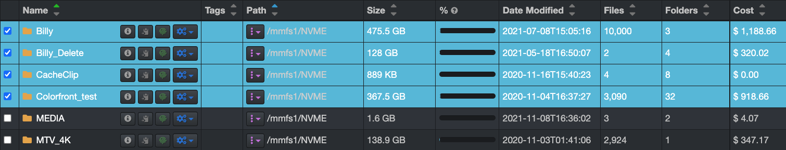
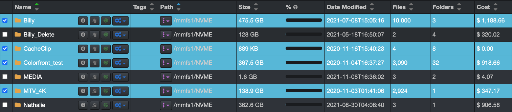

### Line Items Selection

Selecting line items is helpful for multiple reasons, like [exporting results](#export), using [file actions](#file_action), etc.

#### Select or Deselect All

On the [search page](#results_pane), you can select all line items on a page by clicking **Select all** or deselect all line items by clicking  **Unselect All** buttons.

#### Select a Block of Lines

You can select a block of lines by clicking the first line item + hold  **SHIFT**  key + click the last line item.

#### Select Random Line Items

You can select random line items by simply clicking in the box in front of the item, or by holding the  **CTRL**  key for Windows or  **CMD**  key for Mac and clicking each desired line item.

