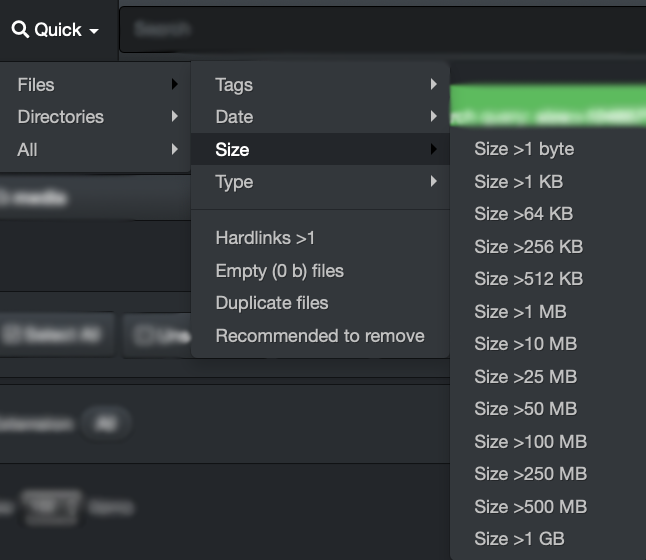

___
### Built-In Search Tool | Quick Search

Quick searches  are convenient when searching on a single pre-established criterion. The drop-down list, and its sub-menus, offer several selections. Here is an example:

Select a criterion and the results will automatically open in the search page.

The possible selections in the drop-down menu are self-explanatory, except maybe hardlinks* which is less common. Select the hardlink criterion if you want to find files with more than 1 hardlink.

>_A hardlink is a pointer/link that acts like a folder/directory. You can only hardlink files and not directories. The term hardlink is usually only used in file systems that allow more than one hard link for the same file. In addition, hardlinks can only refer to files within the same storage volume._

Quick searches  can be used on their own or combined with [filters](#filters). When using the combination of  [filters](#filters) and quick searches, start by selecting the [filters](#filters), then select your quick search criterion. You can always validate your results in the green info bar, example:

A) Criterion selected in the quick searches > for this example, we selected files bigger than 25 MB > 26214400 shows the equivalence of 25 MB in bytes in [binary format](#binary_decimal).

B) Storage volume and directory selected for the search.

C) Criterion selected in the [filters](#filters).
