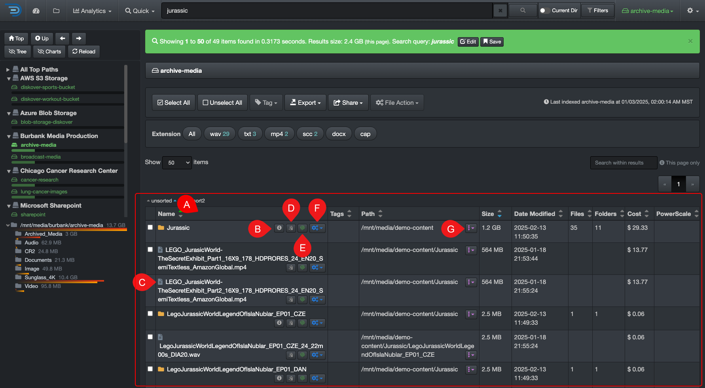

### Results Pane

This section explains the few items that were not covered in the [user interface overview](#ui_overview) .

| REFERENCE | DESCRIPTION |
| :---: | --- |
| A | You can hide or unhide columns via your [settings](#hide_columns). |
| B |  Will open a new tab and display the detailed [attributes](#attributes) for a directory. |
| C |  Click directly on a file to open a new tab and display its detailed [attributes](#attributes). |
| D |  To copy the path of a file or directory to your clipboard - you may have to [adjust your settings](#path_translation) to customize to your operating system. |
| E |  To find similar items, for example, if a directory is named **highres_images**, the search query **highres OR images** will be launched. |
| F |  To run a [File Action](#file_action) on a single file or directory. |
| G |  This will open a drop-down list where you can directly load a path into [analytics](#analytics), along with the option to [search that path recursively or non-recursively](#recursive). |

### Sort Data in the Results Pane

Sorting is possible within Diskover, but if you have a lot of sorting to do, we recommend that you first [export your data in a csv format](#export) and then open that file in Excel, where you can do elaborate sorting and filtering.

A) **Sort legend**: You can do a primary and secondary sort on any columns, ascending or descending, using the arrows in the headers.
  - **Gray arrows**: unsorted
  - **Blue arrow**: primary sort
  - **Green arrow**: secondary sort

B) **Blue arrow/primary sort**: To reassign the primary sort to any column, just click on the arrow in the column you want to reassign the primary sort.

C) **Green arrow/secondary sort**: To reassign the secondary sort, first click on the current green arrow which will remove it, then click on the arrow in the column you want to reassign the secondary sort.

### Search Bar Overlay

When you click in the search bar, a dark grey overlay will appear under it.

#### Shortcut to Launch a Query
The help text in blue will guide you to:

  - Type **!** to launch [smart searches](#smart_searches) > a list of the existing reports will appear which you can click to launch that query.
  - Type **#** to launch [tags report](#tags_report) > a list of the existing tags will appear which you can click to launch that query.

#### Most Recent Searches

Under **Recent searches**, you will find the past 10 queries that you've launched and/or the most recent [paths](#path) you’ve visited. You can click on any of these links to relaunch the same query.

### No Items Found Message

When no items are found during a search, a blue info bar will appear. Use the links in that bar to navigate from there.

A) **Anything**: Will open a fresh file search page and allow you to start a new search.

B) **Help**: Will bring you directly to the user interface help page for search query examples and support.

C) **Reset sort order**: Resets search order for results, more useful for System Administrators.

D) **Go back**: Will bring you back to the previous page and allow you to modify your query, it has the same effect as clicking the back button in your browser.
