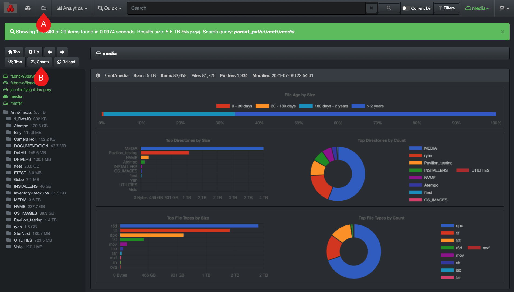
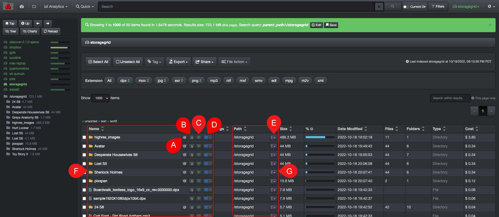
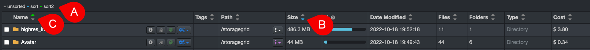
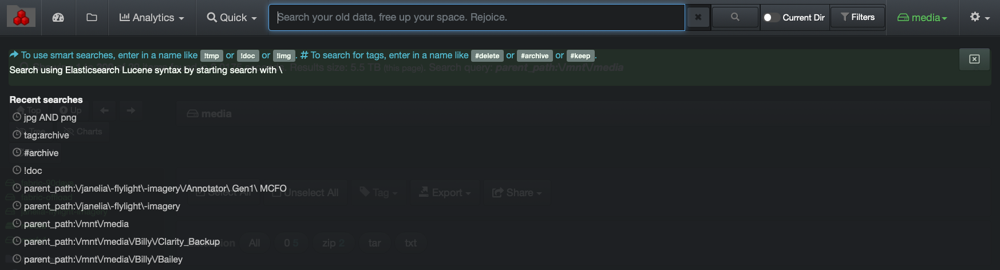
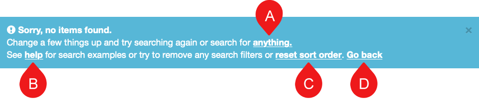

___
### Search Page Default View

A) By default, this file search page will open upon login. If you ever navigate away from it, click the **folder icon** to come back to it.

B) **Charts hide/unhide**: By default, the file search page displays colorful charts at the top of the page giving useful statistics about a selected [path](#path). If you want to hide the charts as they take away space from seeing the results below them, click the **Charts** icon.

### Results Pane Overview

This section explains the few items that were not covered in the [user interface overview](#ui_overview), as well as explain further certain aspects.

A) **Info icon:** Will display the directory’s detailed [attributes](#attributes) by opening a new page.

B) **Copy path/clipboard icon**: To copy the path of a file or directory (E+F). The path syntax is specific to your Operating System and setup by the System Administrator, but can also be modified in your [settings](#path_translation).

C) **Find similar**: To find similar item, example of automatic query that would be run if this would be used on the **highres_images** directory as shown in the image above > **Search query: highres OR images**

D) **File Action**: When you want to use a [file action](#file_action) using a single item.

E) **Reports icon**:  Drop-down list  allowing you to load a path directly in any [analytics](#analytics), as well as the option to [search that path recursively or non-recursively](#recursive_search).

F) **Name**: Displays the name of a directory which is preceded by a folder icon, or a file name which is preceded by a file icon.

G) **Path**: Displays the path where the F) directory or file is located.

>🔆 &nbsp;You can [hide or unhide columns](#hide_columns) via your settings.

### How to Sort Data in the Results Pane

Sorting is possible within Diskover, but if you have a lot of sorting to do, we recommend that you first [export your data in a csv format](#export) and then open that file in Excel, where you can do elaborate sorting and filtering.

A) **Sort legend**: You can do a primary and secondary sort on any columns, ascending or descending, using the arrows in the headers.
  - **Gray arrows**: unsorted
  - **Blue arrow**: primary sort
  - **Green arrow**: secondary sort

B) **Blue arrow/primary sort**: To reassign the primary sort to any column, just click on the arrow in the column you want to reassign the primary sort.

C) **Green arrow/secondary sort**: To reassign the secondary sort, first click on the current green arrow which will remove it, then click on the arrow in the column you want to reassign the secondary sort.

### Search Bar Overlay

When you click in the search bar, a dark grey overlay will appear under it.

#### Shortcut to Launch a Query
The help text in blue will guide you to:

  - Type **!** to launch [smart searches](#smart_searches) > a list of the existing reports will appear which you can click to launch that query.
  - Type **#** to launch [tags report](#tags_report) > a list of the existing tags will appear which you can click to launch that query.

#### Most Recent Searches

Under **Recent searches** you will find the past 10 queries that you've launched and/or the most recent [paths](#path) you’ve visited. You can click on any of these links to relaunch the same query.

### No Items Found Message

When no items are found during a search, a blue info bar will appear. Use the links in that bar to navigate from there.

A) **Anything**: Will open a fresh file search page and allow you to start a new search.

B) **Help**: Will bring you directly to the user interface help page for search query examples and support.

C) **Reset sort order**: Resets search order for results, more useful for System Administrators.

D) **Go back**: Will bring you back to the previous page and allow you to modify your query, it has the same effect as clicking the back button in your browser.
