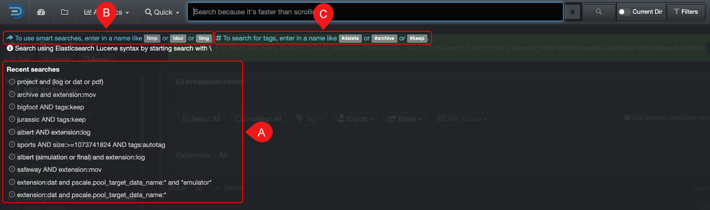
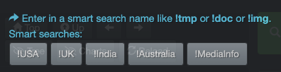
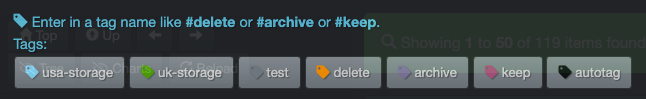

### Results Pane

This section explains the few items that were not covered in the [user interface overview](#ui_overview) .

| REFERENCE | DESCRIPTION |
| :---: | --- |
| A | You can hide or unhide columns via your [settings](#hide_columns). |
| B |  Will open a new tab and display the detailed [attributes](#attributes) for a directory. |
| C |  Click directly on a file to open a new tab and display its detailed [attributes](#attributes). |
| D |  To copy the path of a file or directory to your clipboard - you may have to [adjust your settings](#path_translation) to customize to your operating system. |
| E |  To find similar items, for example, if a directory is named **highres_images**, the search query **highres OR images** will be launched. |
| F |  To run a [File Action](#file_action) on a single file or directory. |
| G |  This will open a drop-down list where you can directly load a path into [analytics](#analytics), along with the option to [search that path recursively or non-recursively](#recursive). |

### Sort Data in the Results Pane

You can sort data within Diskover's results pane, but if you need to do extensive sorting, we recommend [exporting your data as a CSV](#export) first. Once exported, you can open the file in Excel to take advantage of its advanced sorting and filtering options.

| REFERENCE | DESCRIPTION |
| :---: | --- |
| A |  **Legend**: you can sort any column in ascending or descending order using the arrows in the headers. Diskover also supports primary and secondary sorting:<ul><li>**Gray arrows**: unsorted.</li><li>**Blue arrow**: primary sort.</li><li>**Green arrow**: secondary sort.</li><li>**⬆ Ascending**: sorts from smallest to largest, A to Z, or earliest to latest.</li><li>**⬇ Descending**: sorts from largest to smallest, Z to A, or latest to earliest. |
| B | **Reassign primary sort**: to change the primary sort to a different column, simply click the arrow in the header of the column you want to sort by. |
| C | **Reassign secondary sort**: to reassign the secondary sort, first click the current green arrow to remove it. Then, click the arrow in the column you want to set as the new secondary sort. |

### Search Bar Overlay

When you click in the search bar, a dark grey overlay will appear beneath it.

| REFERENCE | DESCRIPTION |
| :---: | --- |
| A |  **Recent searches**: you will find the past 10 queries that you've launched and you can click on any of these links to relaunch the same query. |
| B | **Type ! to launch [smart searches](#smart_searches)**: typing **!** in the search bar will display the list of [smart searches](#smart_searches) you have configured, if any. Clicking on a link will open the results for that report in the search page - it will not launch the analytic:  |
| C | **Type # to launch [tags report](#tags_report)**: typing **#** in the search bar will display the list of [tags](#tags) you have configured, if any. Clicking on a link will open the results for that report in the search page - it will not launch the analytic:  |
| CLOSE | To **close** the overlay:<ol><li>Click anywhere outside of the overlay.</li><li>Use your **ESC** key although this doesn't work with all browsers or OS.</li><li>Click the **X** at the top right corner of the overlay (not displayed in the image above). |

### No Items Found

If no items are found during a search, a blue info bar will appear. You can use the links in the bar to navigate from there.  

| REFERENCE | DESCRIPTION |
| :---: | --- |
| A | **Anything**: this link will open a fresh search page where you can start a new search. |
| B | **Help**: this link will bring you directly to the help page for search query examples and support. |
| C | **Reset sort order**: will reset the [sort order](#default_columns_sort) for results. |
| D | **Go back**: will bring you back to the previous page and allow you to modify your query, it has the same effect as clicking the back button in your browser. |
