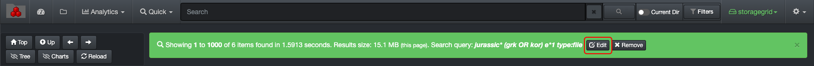
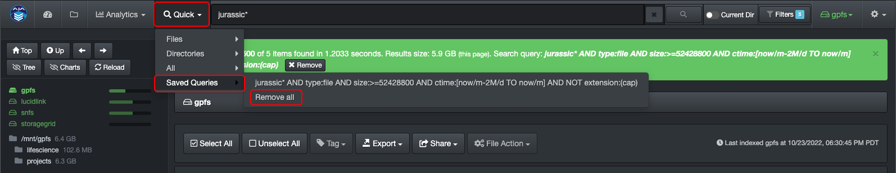

___
### Save Personal Query

&nbsp;&nbsp;&nbsp;&nbsp;&nbsp;&nbsp;&nbsp;&nbsp;

You can save queries in order to re-run them again in one click. Those are saved in the local browser cache and are personal to each user.

#### How to Save a Query

After you've ran a query that you want to save, click the **Save** icon in the green bar.

#### Where to Find a Saved Query

You can find all your saved queries under **Quick** > **Saved Queries**. Just click on any query to launch.

#### How to Edit a Saved Query

Start by launching the query you want to **edit** > click the **edit** icon in the green bar > modify the query in the **search bar** and hit return > this will create a new query with the edited criteria under **Quick**.

#### How to Remove Saved Queries

**To remove a single query** > Launch the query you want to remove by selecting **Quick** > **Saved Queries** > ***desired query*** and then click the **Remove** icon in the green bar.

**To remove all saved queries** > Select **Quick** > **Saved Queries** > **Remove all**.

