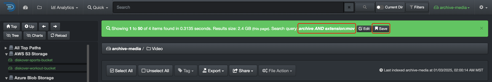
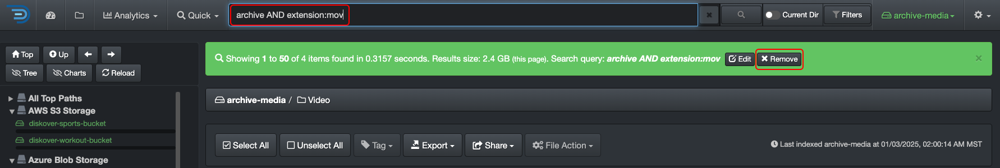
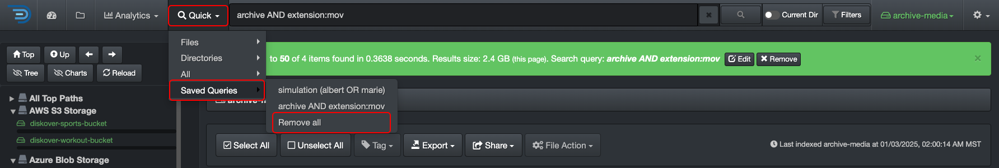

### Save Personal Query

You can save personal queries to easily re-run them later. These are stored in your local browser cache and are only visible to you.  

#### How to Save a Query

After running a query you want to save → click the **Save** button in the green bar. 

#### Where to Find a Saved Query

You can find all your saved queries under **Quick** → **Saved Queries** → click on any query to launch it.  

#### How to Edit a Saved Query

Start by launching the query you want to edit as described above → click the **Edit** button in the green bar → modify the query in the search bar and hit RETURN → this will create a new query with the edited criteria under **Quick**.

#### How to Remove Saved Queries

##### Remove a Single Query

Launch the query you want to remove by selecting **Quick** → **Saved Queries** → launch the query you want to remove →  click the **Remove** button in the green bar.

##### Remove All Saved Queries**

Select **Quick** → **Saved Queries** → click **Remove all**.

