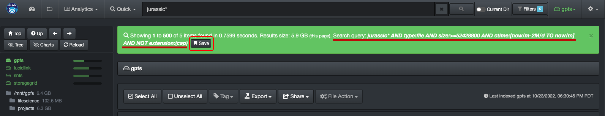
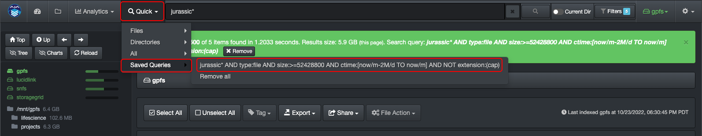
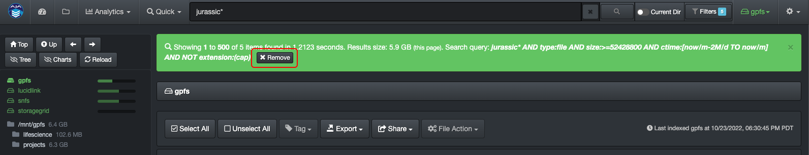

___
### Save Query

&nbsp;&nbsp;&nbsp;&nbsp;

You can save queries in order to re-run them again in one click.

#### How to Save a Query

After you've ran a query that you want to save, click the **Save** icon in the green bar.

#### Where to Find a Saved Query

You can find all your saved queries under **Quick** > **Saved Queries**.

Just click on any query to launch.

#### How to Remove Saved Queries

**To remove a single query** > Launch the query you want to remove by selecting **Quick** > **Saved Queries** > ***desired query*** and then click the **Remove** icon in the green bar.

**To remove all saved queries** > Select **Quick** > **Saved Queries** > **Remove all**.
