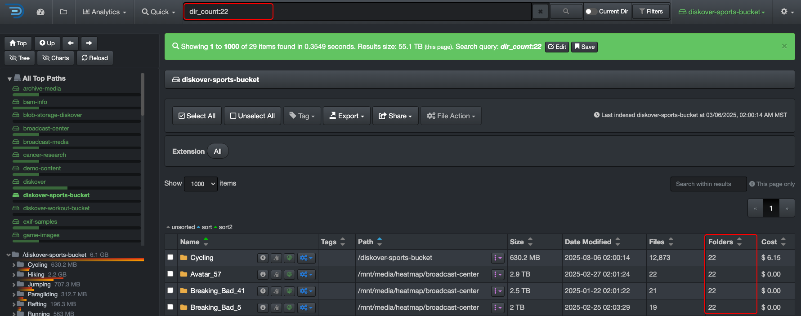
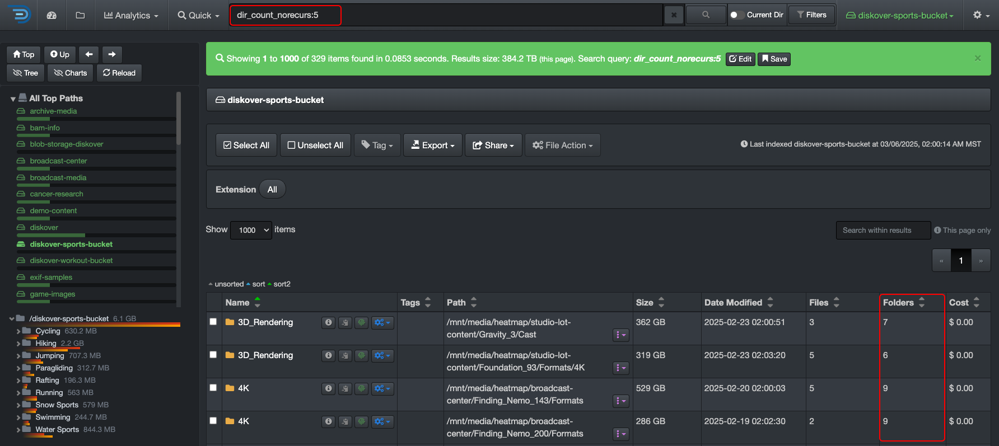
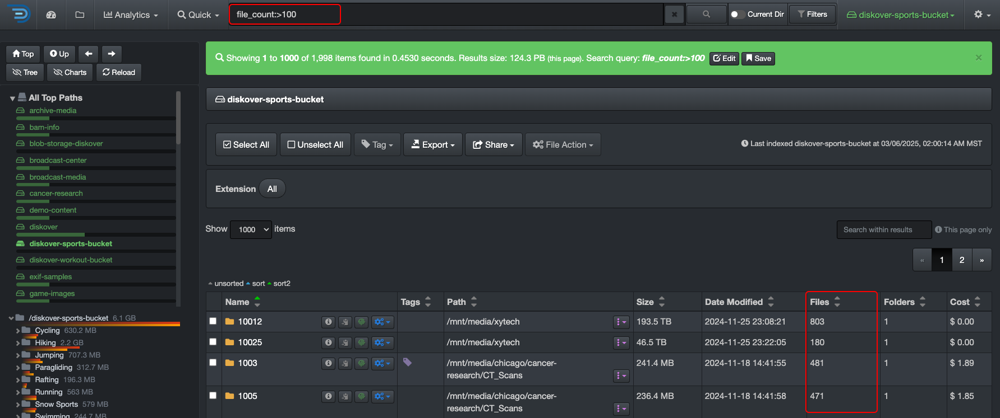

## Manual Queries

### Overview

The examples in this chapter may not be specific to your industry, but the logic of searching is universal. Understanding these concepts will help you apply them effectively in any context. The list of possible search queries and syntax is extensive; therefore, this chapter will cover only the basics of manual searches.  

✏️ Be sure to read the messages in the green and blue information bars in the user interface—they provide helpful guidance! 

#### Many Ways to Search

There are multiple ways to search with Diskover and achieve the same results. You can use the [built-in tools](#builtin_search_tools), manual queries, or a combination of both, depending on your personal preferences and comfort level. 

#### Golden Rules of Searching

Whether you're building simple or complex queries:  

1. **Expand your results**, using [wildcards](#wildcards) for example, and make sure you are not missing any files or directories in your results—[naming convention](#naming_convention) being one of the biggest problems when it comes to searching.
1. **Only add one criterion at a time** and validate your results between each addition. 
1. **Readjust your query** as needed.

#### Search Rules Based on Elasticsearch

Since Diskover uses Elasticsearch to store the harvested metadata and as its search engine, all search syntax in Diskover follows Elasticsearch's rules and algorithms. This chapter will cover many of these rules, but for more details and examples, please [visit the Elasticsearch website](https://www.elastic.co/guide/en/elasticsearch/reference/current/query-dsl-query-string-query.html).

#### Naming Conventions

Many organizations struggle with inconsistent naming conventions, including misspellings. Here are a few examples:

| PROJECT NAME | PROJECT NAME | VERSION | EPISODE |
| --- | --- | --- | --- |
| **North Sea Simulation**<ul><li>northseasimulation</li><li>north_sea_simulation</li><li>NorthSeaSimulation</li><li>NORTH sea sim</li><li>NSea-simulation</li></ul> | **Four Your Eyes Only**<ul><li>ForYourEyesOnly</li><li>foryoureyesonly</li><li>4YourEyesOnly</li><li>for_your_eyes_only</li><li>for your eyes only</li></ul> | **Version 8** <ul><li>v08</li><li>v8</li><li>v_08</li><li>ver8</li><li>ver_008</li></ul> | **Episode 5** <ul><li>ep5</li><li>eps5</li><li>e05</li><li>ep_05</li><li>ep-005</li></ul> | 

To ensure comprehensive results, consider using broader or more flexible search terms. Diskover provides tools to refine or expand your search, allowing you to pinpoint the exact data you need or cast a wider net when necessary.  

### Understanding the Basics and Logic

#### [🍿 Watch Quick Tips | Understanding the Basics of Manual Queries](https://vimeo.com/770024733)

#### Case Sensitivity

Search queries are generally case-insensitive, meaning you can use uppercase or lowercase letters in the search bar without affecting the results. However, there are a few exceptions where queries are case-sensitive:  

- When [searching on time](#search_time).
- When searching on [field names](#search_field_names).

#### Tokenizers | Isolated Characters

When you enter a word, number, or a combination of both in the search bar, Diskover searches for those **isolated characters**. To identify isolated characters, Diskover uses a **tokenizer**, which breaks text apart using isolators such as **spaces, underscores, hyphens, periods, other punctuation marks, and uppercase letters (also known as 🐫 CamelCase)**.

Of course, there are ways to find characters that are not tokenized/isolated by using [wildcards](#wildcards), which is explained in the next section.

##### Tokenization | Examples with Letters

🔎 If you launch a query with the word **albert**:

| FILE NAME | ✅ WHY FILE WOULD BE FOUND | 🚫 WHY FILE WOULD _NOT_ BE FOUND |
| --- | --- | --- |
| `project_albert_overview.pdf` | **albert** is isolated by underscores |  |
| `AlbertSimulationTest_log_v001.txt` | **albert** is isolated by CamelCase |  |
| `albertSIMULATION_test_log_v003.log` | **albert** is isolated by CamelCase | |
| `projectalbert.pdf` |  | **albert** is only isolated on one side with the . |
| `projectalbertoverview.pptx` | | project**albert**overview is read as one word |
| `ProjectALBERTOverview.pptx` | | reads **ALBERTO** |

##### Tokenization | Examples with Numbers

🔎 If you launch a query with the number **2025**:

| FILE NAME | ✅ WHY FILE WOULD BE FOUND | 🚫 WHY FILE WOULD _NOT_ BE FOUND |
| --- | --- | --- |
| `project-albert-2025-draft.pdf` | **2025** is isolated by hyphens |  |
| `mapping log 2025 final.log` | **2025** is isolated by spaces |  |
| `projectalbert2025.pdf`  |  | **2025** is only isolated on one side with the . |
| `MappingLog2025Final.log` |  | CamelCase doesn't work with numbers |
| `QA_testing_20250220.pptx` |  | **2025** is only isolated on one side with the _ |

### Wildcards Overview

#### [🍿 Watch Quick Tips | Manual Search Tool: Wildcards](https://vimeo.com/772196768)

This guide covers 3 major wildcards—they are useful to:

- Expand your results and make sure you are not missing files.
- Go around naming convention issues.
- Search on a specific number of variables.
- Find possible misspellings.

### * Wildcard

#### [🍿 Watch Quick Tips | Manual Search Tool: Wildcards](https://vimeo.com/772196768)

The `*` asterisk wildcard **replaces zero or more characters** and is the most commonly used wildcard. It’s a powerful tool for overcoming [naming convention](#naming_convention) inconsistencies.  

✏️ Using the `*` wildcard in a search may slow down performance, especially when placed at the beginning of a query, as it requires scanning a much larger dataset.  

#### Search Examples Using the *

| 🔎 SEARCH QUERY | ✅ POSSIBLE RESULTS|
| --- | --- |
| `*albert*` | SIMULATIONLOG**ALBERT**.txt project**albert**overview.pptx **albert**xb12p.pdf |
| `R*1005` | **R**-**1005** **R1005** **R**es_**1005** **R**eservoir**1005** |
| `*2025*` | MappingLog**2025**Final.log simulation_**2025**0220.txt |
| `s*1` | **S1** **s**eason **1** **s**0**1** **s**_**1**   ✏️This search query would also find **season 11**, for example, but it’s often better to start with a broader search and then refine your results once you have a better understanding of the data. |

✏️ If you prefer not typing the `*` and ALWAYS want to use it by default, you can set [**Use predictive search**](#predictive_search) in your settings. Throughout this user guide, we assume that predictive search has not been activated.

### ? Wildcard

#### [🍿 Watch Quick Tips | Manual Search Tool: Wildcards](https://vimeo.com/772196768)

The `?` question mark wildcard **replaces a single character** and can be used multiple times to match a specific number of characters.  

| 🔎 SEARCH QUERY | ✅ POSSIBLE RESULTS|
| --- | --- |
| `scene?` | **scene**s **scene**1 |
| `e?2` | **e**p**2** **e**0**2** **e**2**2** |
| `shot??1` | **shot**00**1** **shot**25**1** |
| `project????` | **Project**0021__log.txt **project**logs.log **project**or01.log |
| `r??05` | **r**es**05** **r**10**05** **R**S7**05** |

✏️ Technically, the `*` wildcard could be used instead of multiple `?` characters, but it may return results outside your intended character range since `*` replaces zero or more characters. In cases where precision is needed, the `?` wildcard is often the better choice.  

### ~ Wildcard

#### [🍿 Watch Quick Tips | Manual Search Tool: Wildcards](https://vimeo.com/772196768)

The `~` tilda, aka fuzziness wildcard, is used to find similar words and catches about 80% of all human misspellings.

By default, when used alone, the `~` wildcard allows up to 2 character changes. However, **best practice is to use `~1`** to limit changes to 1, which is usually sufficient to catch about 80% of human misspellings.  

⚠️ Note that using the `~` wildcard in a query can consume a significant amount of memory and may lead to poor performance, potentially resulting in a "timed out" error.  

| 🔎 SEARCH QUERY | ✅ POSSIBLE RESULTS|
| --- | --- |
| `life~1` | live, line, wife, like, rife, lift... |
| `life~` | results from `life~1` + knife, lived, hide, fire, link, loft, love... |
| `jungle~1` | jungle, juggle, jingly, jingle, jingles... |
| `jungle~` | results from `jungle~1` + june, judge, single, bundle, uncle... |

🔆 The query uses the [Damerau-Levenshtein distance](https://en.wikipedia.org/wiki/Damerau-Levenshtein_distance) to find all terms with a maximum of two changes, where a change is the insertion, deletion or substitution of a single character or transposition of two adjacent characters.

### Mixing Wildcards

⚠️ Mixing wildcards can be tricky. Below are a few examples, but remember that additional rules apply when combining wildcards, such as the order in which they are used.  

| 🔎 Mixing wildcards in the same QUERY | 🔎 Mixing wildcards in the same CRITERIA |
| --- | --- |
| You can mix any wildcards in the same query, ex:  `jungle~1 and e*2` `*albert* not v1?` |  You can mix the * and ? but NOT the ~, ex:  What you **can** do: `*albert* 2023????` What you **can't** do: `*albert~1` |

### Operators

Operators are used to join multiple criteria in a query. There are 3 operators: **AND**, **NOT**, **OR**, and they are not case sensitive. 

| AND | NOT | OR | MIX'EM |
| --- | --- | --- | --- |
| 🔎 `albert AND v*1`  ✅ would find **albert** isolated anywhere in the path/file name **and versions ending with 1**.  ✏️ Note that **AND** is assumed if no operators are typed in between two criteria, so the same results would be obtained with `albert v*1` | 🔎 `albert NOT v*1`  ✅ would find **albert** isolated anywhere in the path/file name but would **exclude versions ending with 1**. | 🔎 `albert (v*1 OR v*2)`  ✅ would find **albert** isolated anywhere in the path/file name **and versions ending with 1 or 2**.  ✏️ You need to group the criteria around the **OR** operator to ensure the query is processed correctly—think of it as building formulas in Excel where it requires you to group conditions to interpret your logic accurately. | 🔎 `*test* AND *log* (r*1 OR r*2) NOT 2023`  ✅ would find path/file name with both **test** and **log** isolated or not, with **releases ending with 1 or 2**, but would **exclude anything with 2023 isolated**. |

### Field Names

Searching with field names can be effective when you need precise results, especially if you're searching within a specific or hidden field. You can think of this like searching within a specific column in a massive Excel spreadsheet—rather than scanning the entire dataset, you're narrowing your focus to just the relevant information.

🔎 The query needs to be typed in this exact format **fieldname:_value_**

| **fieldname:** | **_value_** |
| --- | --- |
| <ul><li>Corresponds to the field indexed by Elasticsearch.</li><li>Needs to be typed lowercase.</li></ul>| <ul><li>The _variable_ you are searching.</li><li>Needs to be typed right after the **:** without any spaces.</li><li>Are mostly case sensitive.</li><li>You can use [wildcards](#wildcards).</li></ul> |

### Field Names for Base Metadata

This section outlines the fundamental attributes naturally attached to files and directories, harvested by Diskover without the need for special plugins. The fields are listed alphabetically.

| FIELD NAME | SHORT DESCRIPTION | HOW TO USE |
| --- | --- | --- |
| **atime** | last accessed time | <ul><li>🛠️ Learn how to search on time using Diskover [built-in search tools](#builtin_search_tools).</li><li>🛠️ Learn how to [manually search on time](#search_time).</li></ul> |
| **ctime** | last changed time  | <ul><li>🛠️ Learn how to search on time using Diskover [built-in search tools](#builtin_search_tools).</li><li>🛠️ Learn how to [manually search on time](#search_time).</li></ul> |
| **dir_count** | number of [recursive](#recursive) sub-directories in a directory | <ul><li>🔍 Sample query → `dir_count:22`</li><li>✅ Results → would list all directories containing exactly 22 sub-directories.</li></ul> |
| **dir_count_norecurs** | number of [non-recursive](#recursive) sub-directories a directory | <ul><li>📖 Represents the number of immediate subdirectories within a given directory, excluding any deeper nested folders. Unlike a recursive directory count, which tallies all subdirectories at every level, `ir_count_norecurs` only counts the first-level subdirectories inside a folder. This makes it useful for analyzing folder structures without unnecessary depth.</li><li>🔍 Sample query → `dir_count_norecurs:5`</li><li>✅ Results → directories that contain exactly 5 immediate subdirectories, without counting any deeper nested folders.</li></ul> |
| **dir_depth** | directory depth in a path | <ul><li>🔍 Sample query → `dir_depth:2`</li><li>✅ Results → will return all directories that are exactly at depth level 2 in the directory hierarchy.</li></ul> | 
| **extension** | file extension | <ul><li>🛠️ You can search extension using the [built-in search tools](#builtin_search_tools).</li><li>📖 Manual searches, such as `extension:mov`, help refine results by targeting files with `mov` extension. While a general search for `mov` could return unrelated paths containing those letters (ex: `all_mov_titles_2025.txt`).</li><li>🔍 Sample query →  `extension:mov`</li><li>✅ Results →  ensures precision by filtering only files with the exact `.mov` extension.</li></ul> |
| **file_count** | number of [recursive](#recursive) files inside a directory | <ul><li>📖 Represents the total number of files within a directory, including all files in its subdirectories. Unlike `file_count_norecurs`, which only counts files directly inside a folder, `file_count` provides a recursive total of all files contained within a directory and all its subfolders.</li><li>🛠️ Refer to the [syntax for mathematical symbols](#complex_queries) to learn about the equations you can use to build relevant queries.</li><li>🔍 Sample queries → `file_count:85`, `file_count:10?`, `file_count:>100`</li><li>✅ Results →  using the last example, `file_count:>100`, we search for recursive file counts greater than 100.</li></ul> | 
| **file_count_norecurs** | number of [non-recursive](#recursive) files within a directory | <ul><li>📖 Is used to retrieve the number of files within a directory without counting files in its subdirectories. This makes it an efficient way to quickly assess folder contents at a single directory level rather than performing a full [recursive](#recursive) count. It’s particularly useful for gaining insights into storage structure and identifying clutter without the overhead of deep indexing.</li><li>🔍 Sample query → `file_count_norecurs:<=100`</li><li>✅ Results → will retrieve all directories that contain 100 or fewer files, excluding any files within their subdirectories—this is useful for:<ul><li>Identifying small directories that may be candidates for cleanup or consolidation.</li><li>Finding underutilized folders within a dataset.</li><li>Gaining insights into storage distribution at the directory level without recursive counting.</li></ul><li>🛠️ Refer to the [syntax for mathematical symbols](#complex_queries) to learn about the equations you can use to build relevant queries.</li></ul> |
| **file_size** | file size | <ul><li>🛠️ We recommend using the [built-in search tools](#builtin_search_tools) as you need to translate the size in bytes.</li><li>🛠️ If you want to search manually, refer to [queries with data size](#search_size) for examples.</li></ul> |
| **file_size_du** | disk usage size, aka allocated size, for files only | <ul><li>🛠️ We recommend using the [built-in search tools](#builtin_search_tools) as you need to translate the size in bytes.</li><li>🛠️ If you want to search manually, refer to [queries with data size](#search_size) for examples.</li></ul> |
| **group** | group name associated to a file or directory | <ul><li>🔍 Sample query → `group:engineering`</li><li>✅ Results → would return all files and directories with the group `engineering`</li><li>Groups vastly vary depending on how Diskover is configured, see [User Analysis Report](#user-analysis) section for more details and/or ask your System Administrator.</li></ul> |
| **ino** | inode number of a file or directory | <ul><li>📖 Is a unique identifier assigned by the filesystem. Searching by `ino` allows you to locate a specific file or directory based on its inode, rather than by name or path.</li><li>🔍 Sample query → `ino:8838389885`</li><li>✅ Results → will return the exact file or directory associated with inode `8838389885`.</li><li>This is useful:<ul><li>When a file has been moved or renamed, as the inode remains unchanged while the file’s path might differ.</li><li>It helps in troubleshooting hard links, since multiple files may share the same inode if they point to the same data.</li></ul><li>🛠️ [Learn the differences between inodes and hash values](#inode_vs_hash).</ul> |
| **mtime** | last modified time | <ul><li>🛠️ Learn how to search on time using Diskover [built-in search tools](#builtin_search_tools).</li><li>🛠️ Learn how to [manually search on time](#search_time).</li></ul> |
| **name** | file or directory name | <ul><li>📖 Looks for exact matches or partial matches depending on how the query is formatted—is [case sensitive](#case_sensitivity).</li><li>🔍 Sample query → `name:*Jungle*`</li><li>✅ Results → will return all files and directories that contain the word `Jungle` anywhere in their name as it searches for an exact match or wildcard match in the file/directory name.</li></ul> |
| **name.text** | full-text search analysis, enabling [tokenization](#tokenizer), [stemming](#stemming), and [case-insensitive](#case_sensitivity) matching | <ul><li>📖 Allows for full-text search analysis on file and directory names, making searches more flexible and intuitive compared to the standard `name` field.</li><li>🔍 Sample query #1 → `name.text:jungle`</li><li>✅ Results for sample query #1 → files and directories containing `jungle` in the name, regardless of case or word position.</li><li>🔍 Sample query #2 → `name.text:Jung`</li><li>✅ Results for sample query #2 → may return results like `JungleBook.mov`, even though `Jung` is only part of the word.</li><li>🔍 Sample query #3 → `name.text:Jungle Book`</li><li>✅ Results for sample query #3 → prioritizes phrase matching over scattered words:<ul><li>Woud find → `Jungle Book.mov` or `Jungle_Book.pdf`</li><li>Would possibly find → `The Jungle Book.mp4` (if stop words like “The” are ignored) or `JungleBook_Final.mov` (if tokenization allows for merged words)</li><li>Would likely not find → `The_Book_of_Jungle.mov` (word order is different) or `Jungle Adventure Book.pdf` (words appear separately but not as an exact phrase)</li></ul></ul> |
| **nlink** | number of [hard links](#hardlinks) pointing to a file or directory | <ul><li>🔍 Sample query → `nlink:3`</li><li>✅ Results for files → has three different names (or paths) pointing to the same physical data on disk.</li><li>✅ Results for directories → directories with nlink:3 have exactly one immediate subdirectory, since a directory’s link count is always 2 + the number of its subdirectories.</li></ul> |
| **owner** | owner name associated to a file or directory | <ul><li>🔍 Sample query → `owner:Chris`</li><li>✅ Results → would return all files and directories with the owner `Chris`</li><li>Owners vastly vary depending on how Diskover is configured, see [User Analysis Report](#user-analysis) section for more details and/or ask your System Administrator.</li></ul> |
| **parent_path** | full directory path where a file or subdirectory is located | <ul><li>🔍 Sample query → `parent_path:*game-images*`</li><li>✅ Results → will return all files and directories that are located inside any folder whose path contains `game-images` anywhere in its name, for example:<ul><li>`/projects/game-images/character1.png`</li><li>`/storage/games/thumbnails/game-images/logo.png`</li></ul></ul> |
| **parent_path.text** | Full-text search analysis applied to parent directory paths, enabling [tokenization](#tokenizer), [stemming](#stemming), and [case-insensitive](#case_sensitivity) matching. | <ul><li>📖 Allows for full-text search analysis on directory paths, making searches more flexible and intuitive compared to the standard `parent_path` field.</li><li>🔍 Sample query #1 → `parent_path.text:projects`</li><li>✅ Results for sample query #1 → Finds all files and directories within any parent directory that contains `projects`, regardless of case or position in the path.</li><li>🔍 Sample query #2 → `parent_path.text:media`</li><li>✅ Results for sample query #2 → May return results like `/Media_Archive/film.mov`, `/projects/media_storage/`, or `/backup/media-files/`, even if “media” is only part of a larger directory name.</li><li>🔍 Sample query #3 → `parent_path.text:final edits`</li><li>✅ Results for sample query #3 → Prioritizes phrase matching over scattered words:<ul><li>Would find → `/projects/final edits/scene1.mov` or `/archives/Final_Edits/`</li><li>Would possibly find → `/storage/final-edits_backup/` (if tokenization allows for hyphenated words) or `/FinalEdits/scene2.mp4` (if CamelCase tokenization applies)</li><li>Would likely not find → `/projects/edits_final/` (word order is different) or `/backup/final version edits/` (words appear separately but not as an exact phrase)</li></ul></ul> |
| **size** | file and/or directory size | <ul><li>🛠️ We recommend using the [built-in search tools](#builtin_search_tools) as you need to translate the size in bytes.</li><li>🛠️ If you want to search manually, refer to [queries with data size](#search_size) for examples.</li></ul> |
| **size_norecurs** | size of files within a directory, excluding subdirectories [non-recursive](#recursive) | <ul><li>🛠️ Refer to [queries with data size](#search_size) for examples when searching on size, needs to be translated in bytes.</li><li>🔍 Sample query → `size_norecurs:>1GB `</li><li>✅ Results → all directories that contain more than 1GB of files, but only counting files directly inside the directory (not within subdirectories), does not sum up file sizes from nested subdirectories, only the immediate files inside the queried directory.</li><li>Useful for finding large directories based on immediate file contents without considering nested folders.</li></ul> |
| **size_du** | estimated disk usage of a file or directory, including its contents | <ul><li>📖 Accounts for the total space occupied on disk, including filesystem overhead.</li><li>🛠️ We recommend using the [built-in search tools](#builtin_search_tools) as size values are in bytes.</li><li>🛠️ If you want to search manually, refer to [queries with data size](#search_size) for examples.</li></ul> |
| **size_du_norecurs** | estimated disk usage of files within a directory, excluding subdirectories ([non-recursive](#recursive)) | <ul><li>📖 Includes filesystem overhead, reflecting actual disk space usage rather than just file sizes.</li><li>🛠️ Refer to [queries with data size](#search_size) for examples when searching on size, as values need to be translated into bytes.</li><li>🔍 Sample query → `size_du_norecurs:>1GB`</li><li>✅ Results → Returns directories where the total disk usage of directly stored files (excluding subdirectories) exceeds 1GB. Does not sum up disk usage from nested subdirectories, only the immediate files inside the queried directory.</li><li>Useful for analyzing disk space consumption at the directory level while ignoring deeper subfolder contents.</li></ul> |
| **type** | to focus results on files or directories | <ul><li>🛠️ Is case sensitive, needs to be typed all lowercase.</li><li>🔍 Sample query #1 → `type:file`</li><li>✅ Results for query #1 → would only list files in your results.</li><li>🔍 Sample query #2 → `type:directory`</li><li>✅ Results for query #2 → would only list directories in your results. |

#### Stemming

Stemming is primarily applied to `.text` fields in Diskover searches because these fields use Elasticsearch’s full-text search analysis, which includes stemming, tokenization, and case normalization. However, some other analyzed fields in Diskover may also apply stemming, depending on how they are indexed.

| WHAT | EXAMPLES | WHAT THIS MEANS FOR USERS | 
| --- | --- | --- |
| **Stemming helps find more results by matching different word variations**. Instead of searching for an exact word, Diskover looks for related words with the same root. | <ul><li>Searching `name.text:running`</li><li>Will find `running`</li><li>May also return results for `run`, `runner`, or `runs`</li></ul> | <ul><li>Finds more relevant results without guessing the exact form of a word so you don’t need to type every variation of a word—Diskover does it for you.</li><li>Improves search flexibility, especially when dealing with variations of terms—searching feels more natural, like how Google predicts related words.</li><li>Reduces the need for [wildcard searches](#wildcards) while still returning broad results.</li></ul> |

#### Inodes vs Hash Values

Inodes and hash values both help identify files, but they serve different purposes in file management, search, and deduplication.

| **Feature**          | **Inode**                                           | **Hash Value**                                     |
|---|---|---|
| **What It Represents** | A file’s **unique ID** in the filesystem.        | A file’s **unique fingerprint** based on its content. |
| **How It Works**     | Each file (or directory) is assigned an **inode number** by the filesystem. | A hash function (e.g., MD5, SHA-1) generates a fixed-length value based on the file’s data. |
| **Changes When…**    | File is **moved or renamed** ➝ **Inode stays the same**. | File **content changes** ➝ **Hash changes**. |
| **Used For**         | Tracking files **within the same filesystem** (e.g., hard links). | Verifying file integrity and detecting duplicates **across different storage locations**. |
| **Diskover Search Field** | `ino` (inode number)                            | `hash` (file checksum) not explained in this guide, <a class="email-link" href= "mailto:support@diskoverdata.com?subject=Extra Metadata fields request">Contact us</a> for the list of extra metadata fields enabled in your instance and how to use them. |
| **Key Limitation**   | Inode numbers are **unique only within a single filesystem** (same file copied to another storage system gets a new inode). | Two different files with identical content will have the same hash, but different metadata (name, date, etc.). |

### Field Names for Extra Metadata

Additional metadata fields can be indexed using Diskover's multiple harvest plugins, extending the depth of searchable information beyond the [base metadata](#base_metadata). These plugins enable you to extract specialized metadata tailored to your workflows, providing enhanced visibility and search capabilities. 

<a class="email-link" href= "mailto:support@diskoverdata.com?subject=Extra Metadata fields request">Contact us</a> for a comprehensive list of metadata fields for the plugins in your instance, and how to use them.

### Key-Value Pair

Think of this as a structured way to store and retrieve data, where a **key acts as an identifier**, and the **value holds the associated variable data**. In Diskover, key-value pairs are used for various use cases like search queries, custom reporting, and workflows.

The following examples might look complicated, but you can use the [built-in search tools](#builtin_search_tools) to let Diskover create complicated criteria/queries for you.

| 🔎 QUERY | ✅ RESULT |
| --- | --- |
| `name.text:*jungle* AND (size:>=5242880 AND size:<=10485760)` | Files and directories with **jungle** that are **between 5MB and 10MB**. |
| `*jungle* AND (ctime:[now-1h TO now] OR mtime:[now-1h TO now])` | Files or directories with **jungle** and that have been **modified or changed in the last hour**. |
| `*jungle* AND nlink:2` | Files with **jungle** that have **2 hard links**. |
| `*albert* AND tags:delete AND extension:mov` | All **.mov** files tagged **delete** containing **albert** in its name. |
| `tags:(manual_delete AND approve_delete)` | Files and directories with both tags attached to them - please refer to [complex queries](#complex_queries) regarding the use of the parentheses for grouping. |

### Queries with Data Size

Diskover shows file size (size) and allocated size (size_du) in bytes. We recommend using the [filters](#filters), as well as [quick search](#quick_search) when searching on size, but these fields can also be searched manually. Make sure you are using the proper [syntax for mathematical symbols](#math_symbols) when searching with numbers.

🔆 Use a free *byte converter* available online when unsure how to translate size from MB, GB, etc. to bytes.

Here are some examples when searching on size:

| 🔎 QUERY | ✅ RESULT |
| --- | --- |
| `size:>1048576` | Files and directories larger than 1 MB |
| `size:>10485760 AND type:file` | Files larger than 10 MB |
| `size:>5242880 AND (tags:delete OR tags:approve_delete)` | Files and directories larger than 5 MB tagged delete or approve_delete |
| `size:>=5242880 AND size:<=10485760` | Files or directories equal or larger than 5 MB but equal or smaller than 10 MB |
| `extension:mov AND size:>32212254720` | .mov files larger than 30 GB |

### Queries with Time

Although it is strongly advised to use [filters](#filters) or [quick search](#quick_search) to query time, below are a few examples on how to do so with a manual query.

#### Definitions

| FIELD NAME | DEFINITION |
| :---: | --- |
| **atime** | **last accessed** → the file may have been opened by you, or may have been accessed by some other program or a remote machine. Anytime a file has been accessed, its access time changes. |
| **ctime** | **last changed** → the modification can be in terms of its content or in terms of its attributes—whenever anything about a file changes (except its access time), its ctime changes. |
| **mtime** | **last modified** → indicates the time the contents of the file have been changed—mind you, only the contents, not the attributes—for instance:<ul><li>If you open a file and change some (or all) of its content, its mtime gets updated.</li><li>If you change a file's attribute (like read-write permissions, metadata), its mtime doesn't change, but ctime will.</li></ul> |

#### Formatting

Format to use when searching for date and time - ⚠️ searching on time is case-sensitive.

| VARIABLE | FORMAT |
| :---: | --- |
| **date** | <ul><li>**d** = day</li><li>**M** = month</li><li>**y** = year</li></ul> |
| **time** | <ul><li>**h** = hour</li><li>**m** = minute</li><li>**s** = second</li></ul> |
| **brackets** | These [two types of brackets `[ ]` or `{ }`](#parentheses_brackets) can be used to contain a range of time, they can even be mixed `[ }` |

#### Examples to Find Recent Files

Here are a few examples for finding **files with recent activity**.

| 🔎 QUERY | ✅ RESULT |
| --- | --- |
| `ctime:[now-30m TO now] OR mtime:[now-30m TO now]` | Files that have been modified or changed within the last 30 minutes. |
| `ctime:[now-1h TO now] OR mtime:[now-1h TO now]` | Files that have been modified or changed in the last hour. |
| `ctime:[now-1d TO now]  OR mtime:[now-1d TO now]` | Files that have been modified or changed in the past day. |

#### Examples to Find Old Files

Here are a few examples for finding **old data**.

| 🔎 QUERY | ✅ RESULT |
| --- | --- |
| `mtime:[now-5y TO now-3M]` | Files that haven't been modified in over 3 months but less than 5 years. |
| `mtime:[\* TO now-1y] AND atime:[\* TO now-1y]` | Files that haven't been modified or accessed in over 1 year (**\*** in this case is used to represent "any time in the past"). |

### Complex Queries | Syntax and Grouping

#### Syntax for Mathematical Symbols in Queries

You can only use **:** with letters, but you can use any other with numbers.

| SYNTAX | EQUATION |
| --- | --- |
| **:** | equal to |
| **:>** | greater than |
| **:>=** | equal to or greater than |
| **:<** | lesser than |
| **:<=** | equal to or lesser than |
| **:<>** | is not equal to |

#### When to use Parentheses and Brackets

At times, you will need to group criteria so Diskover can correctly interpret your queries. Think of this like grouping conditions when building formulas in Excel to ensure the logic is applied as intended. This section covers simple to complex groupings using different types of brackets.

| GROUPING TYPE | WHEN TO USE |
| --- | --- |
| **(parentheses)** | **For grouping conditions in logical queries**, ex: (jpg OR png). |
| **[square brackets]** | **Inclusive** ranges for **time**, **dates**, **numeric** or **string fields**, ex: [min TO max] |
| **{curly brackets}** | **Exclusive** ranges for **time**, **dates**, **numeric** or **string fields**, ex: {min TO max} |
| **mix [square and curly }** | `size:[104857600 TO 1073741824}` → Finds files **between 100MB and 1GB**, **including** 100MB (`104,857,600` bytes) but **excluding** 1GB (`1,073,741,824` bytes) `mtime:{now-30d TO now]` → Finds items with a modified time in the last 30 days, **excluding** the exact timestamp of 30 days ago but **including** "now. |

#### Examples with Single Grouping

Here are a few examples using the file name structure **thejunglebook_s01_ep05_en.mov**:

| 🔎 QUERY | ✅ RESULT |
| --- | --- |
| `*jungle* AND (s*1 OR s*2)` |  All files/paths related to season 1 and season 2 for The Jungle Book series. |
| `*jungle* AND e*5 AND (en OR it)` | All Italian (assuming **it** was respected in the naming convention) and English (**en**) translations of episode 5 for The Jungle Book series. |
| `*jungle* AND s*1 (AND extension:(mov OR mp4))` | All files of season 1 with .mov and .mp4 extension, a less precise query could be `*jungle\* AND s*1 AND (mov OR mp4)` |
| `(new york city)` | Files/paths with those 3 words in them, assuming that all the words are isolated of course—the [AND operator](#operators) is assumed |

#### Examples with Multiple Groupings

Here are a few examples:

| FILE NAME EXAMPLE | 🔎 QUERY | ✅ RESULT |
| --- | --- | --- |
| **thejunglebook_s01_ep05_en.mov** | `*jungle\* AND (s*1 OR s*2) (NOT (en OR it))` | All files for season 1 and season 2 of the Jungle Book series, but excluding English and Italian translations. |
| Let's say that you have the following files:<ul><li> **quick brown fox**</li><li>**quick fox**</li><li>**brown fox**</li><li>**fox news** | `((quick AND fox) OR (brown AND fox) OR fox) AND NOT news` | The following conditions would be meet:<ul><li>**fox** must be present.</li><li>**news** must be excluded.</li><li>**quick** and **brown** are optional — their presence increases the relevance. |

